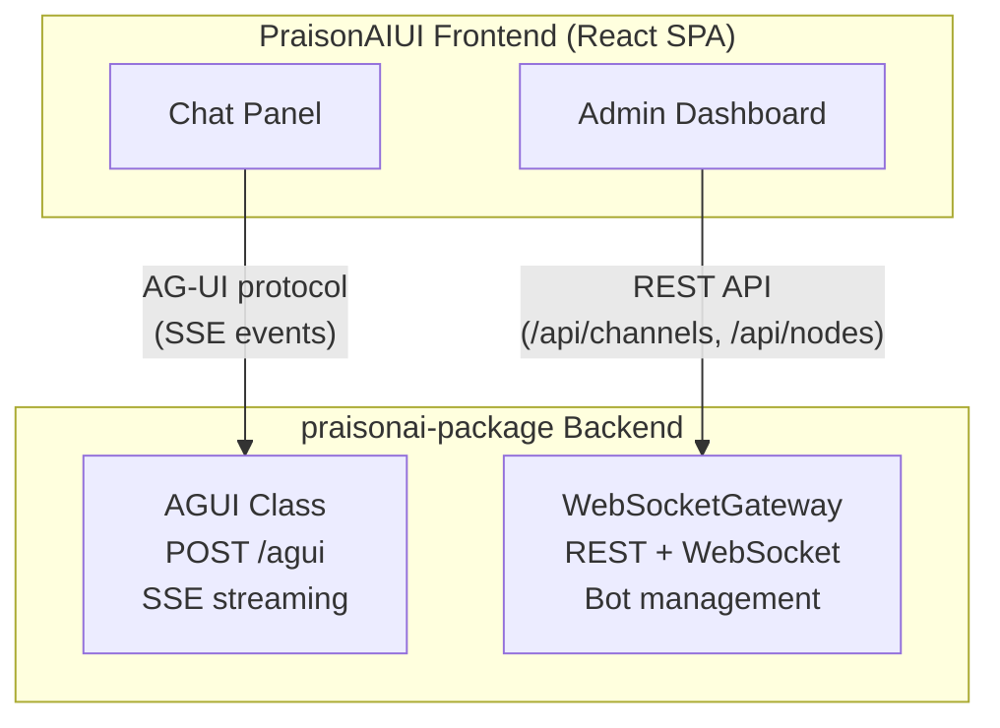
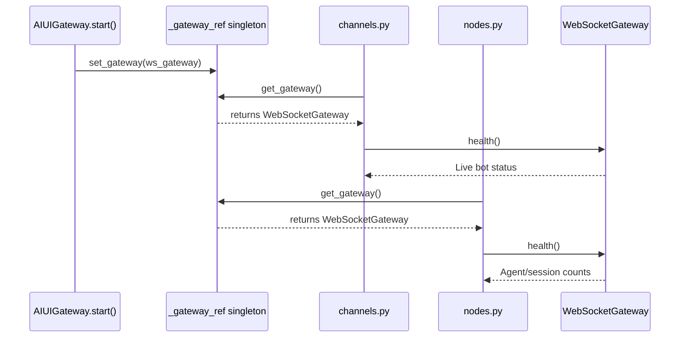

# Architecture: AG-UI Protocol vs Gateway Integration

PraisonAIUI has **two complementary integration layers** with the praisonai backend. They solve different problems and run side-by-side.

## Protocol Stack



AG-UI sits alongside MCP and A2A in the agentic protocol stack:

| Protocol | Purpose |
|----------|---------|
| **MCP** | Gives agents tools |
| **A2A** | Agent-to-agent communication |
| **AG-UI** | Agent-to-user-interface (streaming) |
| **Gateway** | Infrastructure management (channels, nodes, instances) |

## AG-UI — The Conversation Layer

[AG-UI](https://ag-ui.com/) is an **open, event-based protocol** by CopilotKit that standardizes how agent backends stream events to frontends. PraisonAI implements it at `praisonaiagents/ui/agui/`.

**What it does:** Streams ~16 standard event types (text deltas, tool calls, state sync, generative UI) over SSE.

**Who uses it:** LangGraph, CrewAI, Google ADK, Microsoft Agent Framework, AWS Strands, Mastra, Pydantic AI, LlamaIndex, AG2, and PraisonAI.

### Usage

```python
from praisonaiagents import Agent
from praisonaiagents.ui.agui import AGUI
from fastapi import FastAPI

agent = Agent(name="Assistant", role="Helper", goal="Help users")
agui = AGUI(agent=agent)

app = FastAPI()
app.include_router(agui.get_router())
# → POST /agui  (SSE streaming, AG-UI protocol)
# → GET  /status (agent availability)
```

**Frontend compatibility:** CopilotKit, or any AG-UI-compatible client.

## Gateway Integration — The Operations Layer

The gateway integration connects PraisonAIUI's dashboard features to the live `WebSocketGateway` backend for infrastructure management.

**What it does:** CRUD for channels, nodes, instances; live bot status; heartbeat monitoring.

### How It Works



### Key Files

| File | Purpose |
|------|---------|
| `features/_gateway_ref.py` | Thread-safe singleton holding reference to the live gateway |
| `features/channels.py` | Channel CRUD + live status enrichment from gateway |
| `features/nodes.py` | Node CRUD + gateway health enrichment |
| `integration.py` | Calls `set_gateway()` on start, clears on stop |

### API Endpoints

| Endpoint | Methods | Description |
|----------|---------|-------------|
| `/api/channels` | GET, POST | List/create channels |
| `/api/channels/{id}` | GET, PUT, DELETE | Channel CRUD |
| `/api/channels/{id}/toggle` | POST | Enable/disable |
| `/api/channels/{id}/status` | GET | Live running status |
| `/api/channels/platforms` | GET | Supported platforms |
| `/api/nodes` | GET, POST | List/register nodes |
| `/api/nodes/{id}` | GET, PUT, DELETE | Node CRUD |
| `/api/nodes/{id}/status` | GET | Node status + gateway enrichment |
| `/api/nodes/{id}/agents` | GET, PUT | Agent bindings |
| `/api/instances` | GET | Connected instances |
| `/api/instances/heartbeat` | POST | Presence heartbeat |

## Using Both Together

`AIUIGateway.start()` in `integration.py` mounts both layers on the same server:

```python
from praisonaiui.integration import AIUIGateway
from praisonaiagents import Agent

gateway = AIUIGateway(port=8080, static_dir="./dist")
agent = Agent(name="assistant", instructions="You are helpful.")
gateway.register_agent(agent)

await gateway.start()
# Chat:  POST /agui        → AG-UI streaming (via AGUI class)
# Admin: GET  /api/channels → Gateway REST API
# Admin: GET  /api/nodes    → Gateway REST API
# WS:    /ws                → WebSocket for real-time updates
```

## Summary

| | AG-UI (`/agui`) | Gateway (`/api/*`) |
|---|---|---|
| **Layer** | Conversation | Operations |
| **Transport** | SSE (server-sent events) | REST + WebSocket |
| **Purpose** | Stream agent responses to users | Manage channels, nodes, instances |
| **Frontend** | CopilotKit / AG-UI clients | PraisonAIUI React dashboard |
| **Protocol** | Open standard (~16 event types) | Internal REST API |
