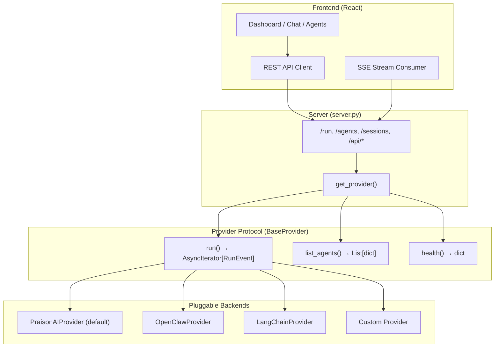

# Providers

PraisonAIUI uses a **provider protocol** — a simple abstraction that lets you plug in any AI backend.

## Architecture



The provider protocol is the **only contract** between the frontend and any AI backend. All dashboard pages (`/api/overview`, `/api/config`, `/api/logs`, etc.) are provider-agnostic — they always work regardless of which backend is active. The provider only handles agent execution (`run()`), agent listing (`list_agents()`), and health checks (`health()`).

## How It Works

1. User sends a message → `POST /run`
2. Server calls `provider.run(message)` on the active provider
3. Provider yields `RunEvent` objects (start, content, tool calls, reasoning, completion)
4. Server serialises each `RunEvent` to an SSE `data:` frame
5. Frontend `useSSE.ts` parses events and renders components

## Built-in Provider: PraisonAI

PraisonAI is the default provider. It wraps the `@aiui.reply` callback system:

```python
import praisonaiui as aiui

@aiui.reply
async def on_message(message: str):
    # Your AI logic here — PraisonAIProvider handles the rest
    await aiui.say("Hello!")
```

No extra config needed — `PraisonAIProvider` is used automatically.

### Agent Tools and Reflection

The default provider resolves tools for agents using `ToolResolver` from the `praisonai` package. Agents created via the CRUD API or YAML config get their tool names (strings) automatically resolved to callable Python functions:

```python
# Agent definition with tools (via CRUD API or YAML):
# tools: ["internet_search", "wikipedia_search"]
#
# ToolResolver resolves these names from 4 sources:
# 1. Local tools.py file
# 2. praisonaiagents.tools.TOOL_MAPPINGS (built-in)
# 3. praisonai_tools package (community)
# 4. Tool registry (programmatic)
```

When no tools are configured, the provider gives agents sensible defaults (`internet_search`).

Agents also support `reflection: true` (default) for self-reflection mode, where the agent evaluates its own response quality before returning.

## Swapping Providers

```python
import praisonaiui as aiui

# Use a custom provider:
aiui.set_provider(MyCustomProvider())
```

## Writing a Custom Provider

Implement `BaseProvider.run()` — that's it:

```python
from praisonaiui.provider import BaseProvider, RunEvent, RunEventType

class EchoProvider(BaseProvider):
    """Echoes messages back — minimal example."""

    async def run(self, message, *, session_id=None, agent_name=None, **kw):
        yield RunEvent(type=RunEventType.RUN_STARTED)
        yield RunEvent(type=RunEventType.RUN_CONTENT, token=f"Echo: {message}")
        yield RunEvent(type=RunEventType.RUN_COMPLETED, content=f"Echo: {message}")
```

### With Tool Calls and Reasoning

```python
class SmartProvider(BaseProvider):
    async def run(self, message, **kw):
        yield RunEvent(type=RunEventType.RUN_STARTED)

        # Emit reasoning steps (shown in ThinkingSteps component)
        yield RunEvent(type=RunEventType.REASONING_STARTED)
        yield RunEvent(type=RunEventType.REASONING_STEP, step="Analyzing the question...")
        yield RunEvent(type=RunEventType.REASONING_STEP, step="Searching knowledge base...")
        yield RunEvent(type=RunEventType.REASONING_COMPLETED)

        # Emit tool calls (shown in ToolCallDisplay component)
        yield RunEvent(
            type=RunEventType.TOOL_CALL_STARTED,
            name="web_search",
            args={"query": message},
        )
        yield RunEvent(
            type=RunEventType.TOOL_CALL_COMPLETED,
            name="web_search",
            result={"results": ["Found relevant info"]},
        )

        # Stream the response token by token
        for word in "Here is the answer".split():
            yield RunEvent(type=RunEventType.RUN_CONTENT, token=word + " ")

        yield RunEvent(type=RunEventType.RUN_COMPLETED, content="Here is the answer")
```

## RunEvent Reference

Every event has a `type` field and optional payload fields:

| Field | Type | Used By |
|-------|------|---------|
| `type` | `RunEventType` | All events |
| `content` | `str` | `RUN_COMPLETED`, `RUN_CONTENT` |
| `token` | `str` | `RUN_CONTENT` (streaming) |
| `name` | `str` | `TOOL_CALL_*` |
| `args` | `dict` | `TOOL_CALL_STARTED` |
| `result` | `any` | `TOOL_CALL_COMPLETED` |
| `step` | `str` | `REASONING_STEP` |
| `error` | `str` | `RUN_ERROR` |
| `agent_name` | `str` | Multi-agent events |
| `extra_data` | `dict` | Custom payload |

### Event Types (27 total)

=== "Agent Events"

    | Type | Description |
    |------|-------------|
    | `run_started` | Agent run begins |
    | `run_content` | Streaming token or content chunk |
    | `run_completed` | Agent run finished |
    | `run_error` | Error occurred |
    | `run_cancelled` | User cancelled |
    | `tool_call_started` | Tool invocation started |
    | `tool_call_completed` | Tool returned result |
    | `reasoning_started` | Thinking begun |
    | `reasoning_step` | Individual reasoning step |
    | `reasoning_completed` | Thinking finished |
    | `memory_update_started` | Memory write begun |
    | `memory_update_completed` | Memory write done |
    | `updating_memory` | Memory being updated |
    | `run_paused` | Run paused (e.g. waiting for user) |
    | `run_continued` | Run resumed |

=== "Team Events"

    | Type | Description |
    |------|-------------|
    | `team_run_started` | Team run begins |
    | `team_run_content` | Team streaming content |
    | `team_run_completed` | Team run finished |
    | `team_run_error` | Team error |
    | `team_run_cancelled` | Team cancelled |
    | `team_tool_call_started` | Team tool call started |
    | `team_tool_call_completed` | Team tool call done |
    | `team_reasoning_started` | Team reasoning begun |
    | `team_reasoning_step` | Team reasoning step |
    | `team_reasoning_completed` | Team reasoning done |
    | `team_memory_update_started` | Team memory update started |
    | `team_memory_update_completed` | Team memory update done |

## API Summary

### `BaseProvider` (abstract)

:   Subclass and implement `run()` to create a custom provider.

    | Method | Description |
    |--------|-------------|
    | `run(message, *, session_id, agent_name, **kw)` | **Required.** Async generator yielding `RunEvent` objects |
    | `list_agents()` | Optional. Returns list of available agents |
    | `health()` | Optional. Returns health check dict |

### `RunEvent` (dataclass)

:   Structured event with `type: RunEventType` and optional payload fields (see table above).

    - `to_dict()` → serialise to JSON-compatible dict matching the frontend `SSEEvent` interface

### `RunEventType` (enum)

:   27 string values matching the frontend `types.ts` — see Agent Events and Team Events tabs above.

### Helper Functions

| Function | Description |
|----------|-------------|
| `praisonaiui.set_provider(provider)` | Set the active provider |
| `praisonaiui.get_provider()` | Get the active provider (lazy-inits `PraisonAIProvider`) |
