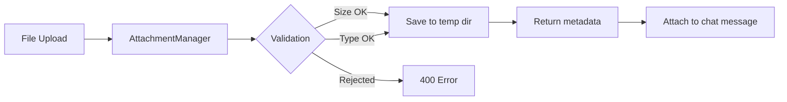

# Chat Attachments

Upload files to include with chat messages — PDFs, CSVs, images, and text files up to 50 MB per file.


## Quick Start

```bash
# Upload a file to a chat session
curl -X POST http://localhost:8083/api/chat/attachments \
  -F "file=@report.pdf" \
  -F "session_id=my-session"
```

## How It Works



## Supported File Types

| Category | Extensions |
|----------|-----------|
| Documents | `.pdf`, `.doc`, `.docx`, `.txt`, `.md` |
| Data | `.csv`, `.json`, `.xml`, `.yaml`, `.yml` |
| Images | `.png`, `.jpg`, `.jpeg`, `.gif`, `.webp`, `.svg` |
| Code | `.py`, `.js`, `.ts`, `.html`, `.css` |

!!! warning "Blocked Types"
    Executable files (`.exe`, `.sh`, `.bat`, `.cmd`, `.com`) are rejected by default.

## Configuration

```python
from praisonaiui.features.attachments import AttachmentManager

# Custom limits
mgr = AttachmentManager(
    max_size_mb=100,          # Max file size in MB (default: 50)
    allowed_types={"text/*", "image/*", "application/pdf"},
)
```

## REST API

| Endpoint | Method | Description |
|----------|--------|-------------|
| `/api/chat/attachments` | POST | Upload a file |
| `/api/chat/attachments` | GET | List attachments for a session |
| `/api/chat/attachments/{id}` | DELETE | Delete an attachment |

### Upload

```bash
curl -X POST http://localhost:8083/api/chat/attachments \
  -F "file=@data.csv" \
  -F "session_id=abc-123"
```

Response:
```json
{
  "id": "att_a1b2c3d4",
  "filename": "data.csv",
  "content_type": "text/csv",
  "size": 34800,
  "session_id": "abc-123"
}
```

### List

```bash
curl http://localhost:8083/api/chat/attachments?session_id=abc-123
```

## Related

- [Gateway Chat](gateway-chat.md) — Chat interface
- [Sessions](sessions.md) — Session management
