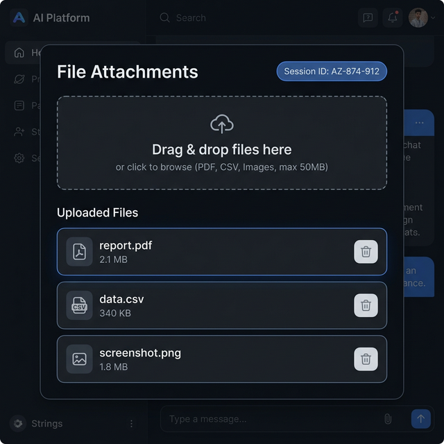
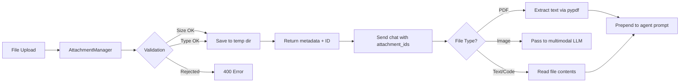

# Chat Attachments

Upload files to include with chat messages — PDFs, CSVs, images, and text files up to 50 MB per file. Uploaded files are **automatically processed** and their content is injected into the agent's prompt.



## Quick Start

```bash
# 1. Upload a file
RESP=$(curl -s -X POST http://localhost:8083/api/chat/attachments \
  -F "file=@report.pdf" \
  -F "session_id=my-session")

# 2. Send chat with the attachment
ATT_ID=$(echo $RESP | python3 -c "import sys,json; print(json.load(sys.stdin)['id'])")
curl -X POST http://localhost:8083/api/chat/send \
  -H "Content-Type: application/json" \
  -d "{\"content\":\"Summarize this document\",\"session_id\":\"my-session\",\"attachment_ids\":[\"$ATT_ID\"]}"
```

The agent will receive the extracted PDF text prepended to the user message and can answer questions about the document's content.

## How It Works



## File Processing by Type

When you send a chat message with `attachment_ids`, each attachment is processed based on its type:

| File Type | Processing | What the Agent Sees |
|-----------|-----------|-------------------|
| **PDF** (`.pdf`) | Text extracted via `pypdf` | Full text content prepended to prompt |
| **Images** (`.png`, `.jpg`, etc.) | Passed to SDK multimodal handler | Image sent as base64 to vision-capable LLMs |
| **Text/Code** (`.txt`, `.py`, `.csv`, etc.) | File contents read directly | Full file content prepended to prompt |

!!! note "PDF Dependency"
    PDF text extraction requires the `pypdf` package (`pip install pypdf`). If `pypdf` is not installed, a fallback message is shown instead of the extracted text. `pypdf` is included in PraisonAIUI's dependencies by default.

## Supported File Types

| Category | Extensions |
|----------|-----------|
| Documents | `.pdf`, `.doc`, `.docx`, `.txt`, `.md` |
| Data | `.csv`, `.json`, `.xml`, `.yaml`, `.yml` |
| Images | `.png`, `.jpg`, `.jpeg`, `.gif`, `.webp`, `.svg` |
| Code | `.py`, `.js`, `.ts`, `.html`, `.css` |

!!! warning "Blocked Types"
    Executable files (`.exe`, `.sh`, `.bat`, `.cmd`, `.com`) are rejected by default.

## Configuration

```python
from praisonaiui.features.attachments import AttachmentManager

# Custom limits
mgr = AttachmentManager(
    max_size_mb=100,          # Max file size in MB (default: 50)
    allowed_types={"text/*", "image/*", "application/pdf"},
)
```

## REST API

| Endpoint | Method | Description |
|----------|--------|-------------|
| `/api/chat/attachments` | POST | Upload a file |
| `/api/chat/attachments` | GET | List attachments for a session |
| `/api/chat/attachments/{id}` | DELETE | Delete an attachment |

### Upload

```bash
curl -X POST http://localhost:8083/api/chat/attachments \
  -F "file=@data.csv" \
  -F "session_id=abc-123"
```

Response:
```json
{
  "id": "att_a1b2c3d4",
  "filename": "data.csv",
  "content_type": "text/csv",
  "size": 34800,
  "session_id": "abc-123"
}
```

### Send Chat with Attachments

```bash
curl -X POST http://localhost:8083/api/chat/send \
  -H "Content-Type: application/json" \
  -d '{
    "content": "What does this document say?",
    "session_id": "abc-123",
    "attachment_ids": ["att_a1b2c3d4"]
  }'
```

The `attachment_ids` array links uploaded files to the chat message. The server extracts content from each attachment and prepends it to the user's message before sending to the agent.

### List

```bash
curl http://localhost:8083/api/chat/attachments?session_id=abc-123
```

## WebSocket

When sending messages via WebSocket, include `attachment_ids` in the message payload:

```json
{
  "type": "chat",
  "content": "Analyze this PDF",
  "session_id": "abc-123",
  "attachment_ids": ["att_a1b2c3d4"]
}
```

## Related

- [Gateway Chat](gateway-chat.md) — Chat interface
- [Sessions](sessions.md) — Session management
