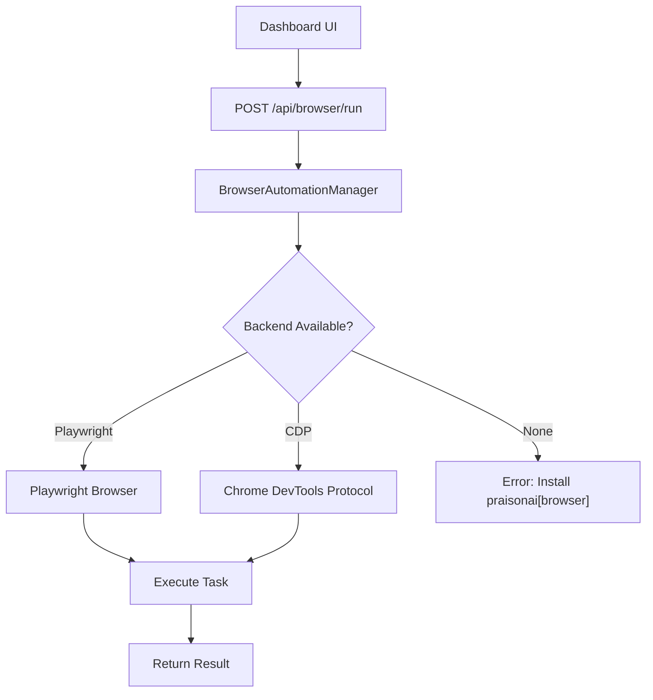

# Browser Automation

Expose **browser agent capabilities** (CDP, Playwright) through the dashboard — run browser tasks from the UI.

## Quick Start

```bash
# Check browser automation status
curl http://localhost:8083/api/browser/status

# Run a browser task
curl -X POST http://localhost:8083/api/browser/run \
  -H "Content-Type: application/json" \
  -d '{"task": "Go to example.com and extract the page title", "url": "https://example.com"}'
```

## How It Works



## Prerequisites

Browser automation requires `praisonai[browser]`:

```bash
pip install praisonai[browser]
```

This installs the Playwright and/or CDP backends.

## Status

The status endpoint reports which backends are available:

```bash
curl http://localhost:8083/api/browser/status
```

```json
{
  "available": true,
  "tasks_run": 5,
  "backends": ["playwright", "cdp"]
}
```

## REST API

| Endpoint | Method | Description |
|----------|--------|-------------|
| `/api/browser/status` | GET | Check availability and stats |
| `/api/browser/run` | POST | Execute a browser task |

### Run Task

```bash
curl -X POST http://localhost:8083/api/browser/run \
  -H "Content-Type: application/json" \
  -d '{
    "task": "Search for PraisonAI on Google",
    "url": "https://google.com"
  }'
```

```json
{
  "status": "completed",
  "result": "Found 10 results for PraisonAI..."
}
```

## Related

- [Gateway Chat](gateway-chat.md) — Chat can trigger browser tasks via tools
- [Protocols](protocols.md) — Feature protocol system
