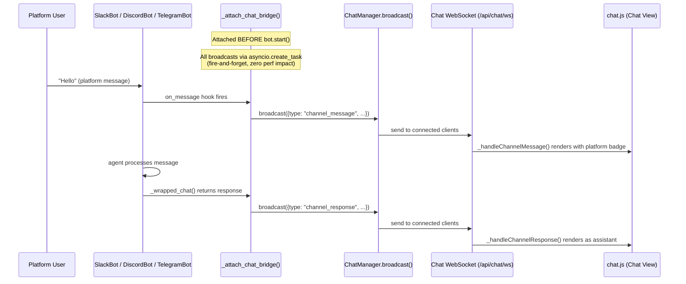

# Channel-to-Chat Bridge

Bridge channel bot conversations (Slack, Discord, Telegram) into the Chat UI in real-time.

## Architecture



## How It Works

### Backend (`channels.py`)

`_attach_chat_bridge(channel_id, bot, platform)` is called in `_start_channel_bot()` right before the bot task is launched:

1. **`on_message` hook** — Captures incoming platform messages and broadcasts `channel_message` events with sender name, platform, and icon
2. **`_session.chat()` wrapper** — Wraps the agent's chat method so responses are also broadcast as `channel_response` events
3. **Persistence** — All messages saved to the datastore under session `channel-{channel_id}` for history on reload

### Frontend (`chat.js`)

| Function | Purpose |
|---|---|
| `_handleChannelMessage(data)` | Renders incoming platform user messages; auto-switches to channel session if on fresh chat |
| `_handleChannelResponse(data)` | Renders agent responses from channel bots |
| `_appendChannelMsg(role, data)` | Creates message DOM with platform badge, icon, sender name |
| `_markSessionUnread(sessionId)` | Adds unread dot to sidebar for inactive channel sessions |

## Performance

Every broadcast is dispatched via `asyncio.create_task()` — the original bot message handling is **never blocked**. Errors in broadcasting are logged at `debug` level and swallowed — the bot continues normally even with zero Chat UI clients connected.

## Session Naming

Each channel gets a dedicated session: `channel-{channel_id}`. Platform icons:

| Platform | Icon |
|---|---|
| Slack | 💬 |
| Discord | 🎮 |
| Telegram | ✈️ |
| WhatsApp | 📱 |

## WebSocket Events

### `channel_message`

```json
{
  "type": "channel_message",
  "session_id": "channel-abc123",
  "channel_id": "abc123",
  "platform": "slack",
  "icon": "💬",
  "content": "Hello from Slack!",
  "sender": "john.doe",
  "timestamp": 1773033464.37
}
```

### `channel_response`

```json
{
  "type": "channel_response",
  "session_id": "channel-abc123",
  "channel_id": "abc123",
  "platform": "slack",
  "icon": "💬",
  "content": "Hi! How can I help?",
  "agent_name": "assistant",
  "timestamp": 1773033465.12
}
```
