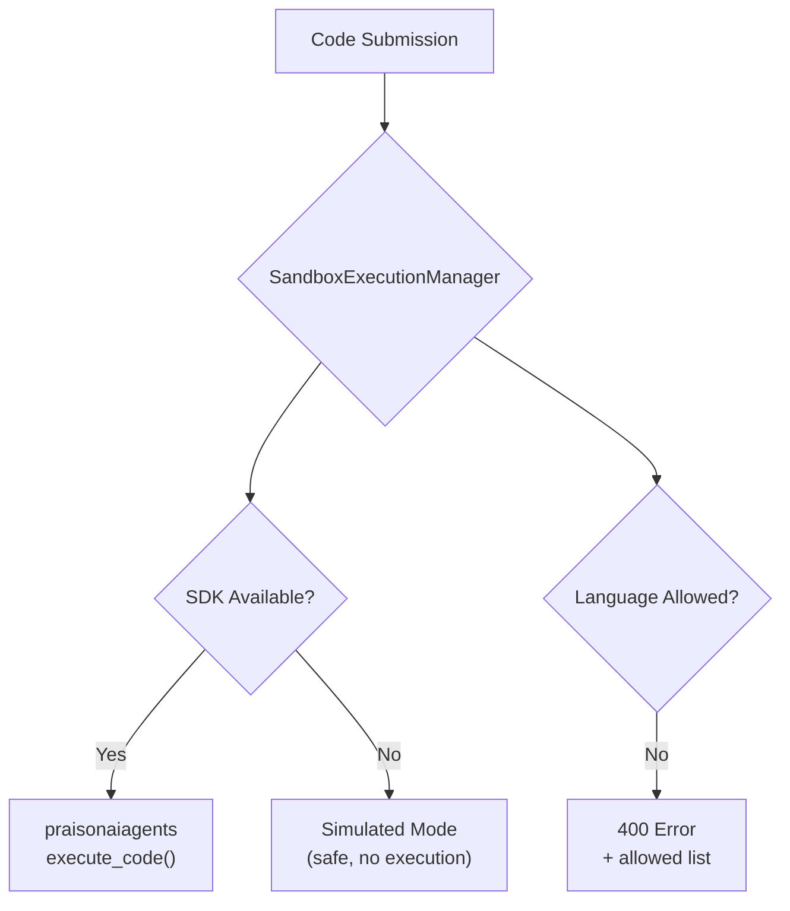

# Code Execution

**Sandboxed code execution** with language allowlists and SDK integration. Wraps `praisonaiagents.tools.code.execute_code` when available, falls back to safe simulation mode.

## Quick Start

```bash
# List supported languages
curl http://localhost:8083/api/code/languages

# Execute code
curl -X POST http://localhost:8083/api/code/execute \
  -H "Content-Type: application/json" \
  -d '{"code":"print(\"Hello World\")","language":"python"}'
```

## How It Works



1. Code is submitted with a target language
2. The manager checks if the language is in the **allowlist** (default: python, javascript, bash)
3. If `praisonaiagents` is installed, delegates to `execute_code` for real execution
4. Otherwise returns a simulation response with the code size

## Configuration

```python
from praisonaiui.features.code_execution import SandboxExecutionManager, set_execution_manager

# Custom configuration
mgr = SandboxExecutionManager(
    sandbox=True,                              # Enable sandbox mode
    timeout=60,                                # Execution timeout
    allowed_languages=["python", "javascript"] # Only allow these languages
)
set_execution_manager(mgr)
```

## REST API

| Endpoint | Method | Description |
|----------|--------|-------------|
| `/api/code/languages` | GET | List supported languages |
| `/api/code/execute` | POST | Execute code in sandbox |

### POST /api/code/execute

```json
// Request
{"code": "print('hello')", "language": "python", "timeout": 30}

// Response (simulated mode)
{"language": "python", "status": "simulated",
 "output": "[Sandbox] Code received (15 chars, python)",
 "sandbox": true, "note": "Install praisonaiagents for real execution"}

// Response (disallowed language → 400)
{"status": "error", "error": "Language 'ruby' not allowed",
 "allowed": ["python", "bash", "javascript"]}
```

## Related

- [Skills](../api/features-api.md#skills) — Code execution tools in the skill catalog
