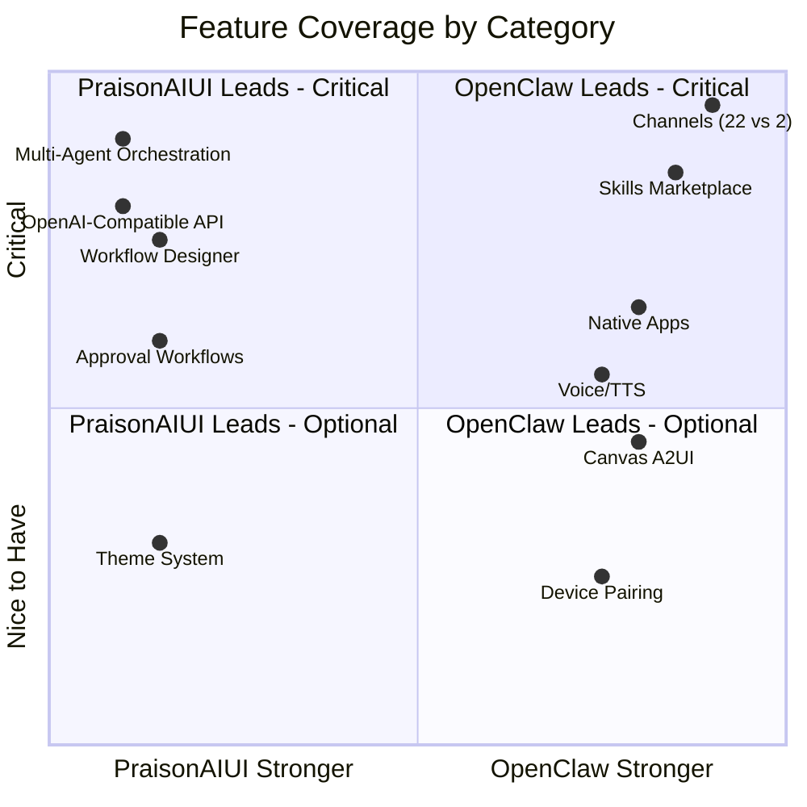

# Feature Comparison: PraisonAIUI vs OpenClaw

> **Last validated**: 2026-03-06 — PraisonAIUI features verified programmatically, OpenClaw features sourced from GitHub README and docs

## Summary

| Aspect | PraisonAIUI | OpenClaw |
|--------|-------------|----------|
| **Focus** | Multi-agent orchestration dashboard | Personal AI assistant gateway |
| **Language** | Python (Starlette) | TypeScript (Node.js) |
| **Stars** | Growing | 100k+ |
| **Architecture** | Protocol-driven feature modules | Gateway + Channel adapters |
| **Registered Features** | 24 | ~15 core subsystems |
| **API Routes** | 164 | ~50 (WebSocket-focused) |
| **Channels** | 8 configured, **4 working bots** (Discord, Telegram, Slack, WhatsApp) | **22 working channels** |
| **Skills/Tools** | 20+ built-in tools | **13,000+ via ClawHub** |
| **Native Apps** | Web only | macOS, iOS, Android |

---

## Feature-by-Feature Comparison

### 🟢 = Implemented | 🟡 = Partial | 🔴 = Missing

### Chat & Communication

| Feature | PraisonAIUI | OpenClaw | Notes |
|---------|:-----------:|:--------:|-------|
| WebSocket chat streaming | 🟢 | 🟢 | Both have real-time streaming |
| Markdown rendering | 🟢 | 🟢 | PraisonAIUI: custom renderer; OpenClaw: native |
| Tool call display | 🟢 | 🟢 | Both show tool calls inline |
| Code block syntax highlight | 🟢 | 🟢 | CSS-based |
| Message abort/cancel | 🟢 | 🟢 | |
| File attachments | 🟢 | 🟢 | |
| XSS sanitization | 🟢 | 🟢 | |
| Typing indicators | 🔴 | 🟢 | OpenClaw sends typing events |
| Presence detection | 🔴 | 🟢 | OpenClaw tracks user presence |
| WebChat embeddable widget | 🔴 | 🟢 | OpenClaw serves WebChat from Gateway |
| Group chat routing | 🔴 | 🟢 | OpenClaw: mention gating, reply tags |

### Messaging Channels ( DONT NEED ADDITIONAL CHANNELS IN PRAISONAI for now)

| Channel | PraisonAIUI | OpenClaw | Notes |
|---------|:-----------:|:--------:|-------|
| Discord | 🟢 SDK: DiscordBot (487 lines) | 🟢 discord.js | Both have full bots |
| Telegram | 🟢 SDK: TelegramBot (710 lines) | 🟢 grammY | Both have full bots |
| Slack | 🟢 SDK: SlackBot (593 lines) | 🟢 Bolt | Both have full bots |
| WhatsApp | 🟢 SDK: WhatsAppBot (959 lines) | 🟢 Baileys | Both have full bots (Cloud API + Web) |
| Signal | 🟡 config only | 🟢 signal-cli | SDK bot not yet built |
| iMessage / BlueBubbles | 🟡 config only | 🟢 BlueBubbles | SDK bot not yet built |
| Google Chat | 🟡 config only | 🟢 Chat API | SDK bot not yet built |
| Nostr | 🟡 config only | 🟢 | SDK bot not yet built |
| IRC | 🔴 | 🟢 | Not in PraisonAI |
| Microsoft Teams | 🔴 | 🟢 | Not in PraisonAIUI |
| Matrix | 🔴 | 🟢 | Not in PraisonAIUI |
| LINE | 🔴 | 🟢 | Not in PraisonAIUI |
| Feishu (Lark) | 🔴 | 🟢 | Not in PraisonAIUI |
| Mattermost | 🔴 | 🟢 | Not in PraisonAIUI |
| Twitch | 🔴 | 🟢 | Not in PraisonAIUI |
| Zalo | 🔴 | 🟢 | Not in PraisonAIUI |
| Nextcloud Talk | 🔴 | 🟢 | Not in PraisonAIUI |
| Synology Chat | 🔴 | 🟢 | Not in PraisonAIUI |
| Tlon | 🔴 | 🟢 | Not in PraisonAIUI |
| **Total Working** | **4** (via SDK) | **22** | **Gap: 18 channels** |

### Agent & Orchestration

| Feature | PraisonAIUI | OpenClaw | Notes |
|---------|:-----------:|:--------:|-------|
| Agent CRUD (create/edit/delete) | 🟢 8 routes | 🟡 config-only | **PraisonAIUI ahead** — full REST API |
| Multi-agent orchestration | 🟢 | 🟡 | **PraisonAIUI ahead** — Pipeline, Route, Parallel, Loop |
| Workflow designer | 🟢 8 routes | 🔴 | **PraisonAIUI ahead** — visual workflows |
| Subagent tree view | 🟢 | 🟡 | **PraisonAIUI ahead** — hierarchy tracking |
| Agent-to-agent messaging | 🔴 | 🟢 sessions_* tools | OpenClaw has inter-agent sessions |
| Multi-agent routing | 🟡 | 🟢 | OpenClaw routes channels → isolated agents |
| Agent playground (run) | 🟢 | 🟢 | Both can trigger agent runs |

### Sessions & Memory

| Feature | PraisonAIUI | OpenClaw | Notes |
|---------|:-----------:|:--------:|-------|
| Session CRUD | 🟢 10 routes | 🟢 | Both have session management |
| Session state/context | 🟢 | 🟢 | |
| Session labels/tags | 🟢 | 🔴 | **PraisonAIUI ahead** |
| Session compaction | 🟢 | 🟢 session pruning | Both support pruning |
| Memory (short/long/entity) | 🟢 6 routes | 🟢 markdown docs | Different approaches |
| Memory search in chat | 🟡 SDK has it, UI not wired | 🟢 | SDK: `Agent.get_memory_context()` exists |
| Persistent workspace memory | 🟢 SDK: FileMemory (1619 lines) | 🟢 | SDK: ChromaDB, MongoDB, Mem0 backends |

### Tools & Skills

| Feature | PraisonAIUI | OpenClaw | Notes |
|---------|:-----------:|:--------:|-------|
| Tool catalog | 🟢 20+ built-in | 🟢 | |
| Tool enable/disable | 🟢 8 routes | 🟢 | |
| API key management | 🟢 | 🟡 env vars | **PraisonAIUI ahead** — per-tool config UI |
| Skills marketplace | 🔴 | 🟢 **13,000+ ClawHub** | **Biggest gap** |
| Skill install gating | 🔴 | 🟢 | OpenClaw: bundled/managed/workspace |
| Custom skill creation | 🟢 | 🟢 SKILL.md | Different formats |
| MCP tool support | 🟢 64+ tools | 🟡 | **PraisonAIUI ahead** |
| Browser automation | 🟢 CDP/Playwright | 🟢 dedicated Chrome | Both supported |
| Code execution | 🟡 tool exists, no view | 🟢 | OpenClaw: PT execution |
| Cron/scheduled tasks | 🟢 9 routes | 🟢 | Both supported |
| Webhooks | 🟢 via hooks | 🟢 | Both supported |

### Configuration & Admin

| Feature | PraisonAIUI | OpenClaw | Notes |
|---------|:-----------:|:--------:|-------|
| Runtime config API | 🟢 11 routes | 🟢 | |
| Config hot-reload | 🟢 file watcher | 🟢 | Both have live reload |
| Config validation/schema | 🟢 | 🔴 | **PraisonAIUI ahead** |
| Authentication | 🟢 10 routes | 🟢 token/password | Both supported |
| Approval workflows | 🟢 10 routes | 🔴 | **PraisonAIUI ahead** |
| Hooks (pre/post) | 🟢 6 routes | 🔴 | **PraisonAIUI ahead** |
| Usage/cost tracking | 🟢 9 routes | 🟢 | Both supported |
| OpenAI-compatible API | 🟢 17 routes | 🔴 | **PraisonAIUI ahead** — full `/v1/*` |
| Model fallback chain | 🟢 | 🟢 model failover | Both supported |
| Protocol versioning | 🟢 | 🔴 | **PraisonAIUI ahead** |

### Platform & UX

| Feature | PraisonAIUI | OpenClaw | Notes |
|---------|:-----------:|:--------:|-------|
| Web dashboard | 🟢 12 views | 🟢 Control UI | Both have web UIs |
| Theme system (dark/light) | 🟢 | 🔴 | **PraisonAIUI ahead** |
| macOS native app | 🔴 | 🟢 menu bar | |
| iOS app | 🔴 | 🟢 | |
| Android app | 🔴 | 🟢 | |
| Voice Wake (wake word) | 🔴 | 🟢 | macOS + iOS |
| Talk Mode (voice chat) | 🔴 | 🟢 | ElevenLabs + system TTS |
| Canvas (visual workspace) | 🔴 | 🟢 A2UI | Agent-driven UI |
| Device pairing | 🔴 | 🟢 Bonjour | iOS/Android → Gateway |
| PWA support | 🔴 | 🔴 | Neither has PWA |
| i18n / localization | 🔴 | 🔴 | Neither has i18n |

### Media

| Feature | PraisonAIUI | OpenClaw | Notes |
|---------|:-----------:|:--------:|-------|
| Image upload/display | 🟢 attachments | 🟢 | |
| Image understanding | 🟢 SDK: VisionAgent (449 lines) | 🟢 media pipeline | SDK has describe/analyze/compare/extract_text |
| OCR | 🟢 SDK: OCRAgent (298 lines) | 🟡 | SDK has PDF + image OCR with Mistral |
| Audio transcription | 🟢 SDK: `stt_tool` + bot STT | 🟢 | Both have auto-transcribe |
| TTS (text-to-speech) | 🟡 `/v1/audio/speech` + bot TTS | 🟢 Talk Mode | Minor: needs `tts_tool` |
| Video processing | 🔴 | 🟢 | OpenClaw: camera snap/clip |
| Screen recording | 🔴 | 🟢 | iOS/Android/macOS nodes |

### Infrastructure & Deployment

| Feature | PraisonAIUI | OpenClaw | Notes |
|---------|:-----------:|:--------:|-------|
| Docker deployment | 🟢 | 🟢 | Both supported |
| Nix mode | 🔴 | 🟢 | |
| Node clustering | 🟢 10 routes | 🟡 | **PraisonAIUI ahead** — full node API |
| Remote gateway (Tailscale) | 🔴 | 🟢 Serve/Funnel | |
| Log streaming | 🟢 WebSocket | 🟢 | Both have real-time logs |
| Health monitoring | 🟢 per-feature | 🟢 | |
| Doctor command | 🔴 | 🟢 | OpenClaw: migrations + diagnostics |
| Job queue | 🟢 9 routes | 🔴 | **PraisonAIUI ahead** |

---

## Competitive Analysis

### Where PraisonAIUI is Ahead ✅

| Area | Advantage |
|------|-----------|
| **Multi-agent orchestration** | Pipeline, Route, Parallel, Loop — no equivalent in OpenClaw |
| **OpenAI-compatible API** | Full `/v1/*` — clients can use OpenAI SDK directly |
| **Workflow designer** | 8-route workflow CRUD with run/status tracking |
| **Approval workflows** | 10-route approval system for tool execution gating |
| **API surface area** | 164 REST routes vs ~50 in OpenClaw |
| **Config validation** | Schema-driven with history tracking |
| **Hooks system** | Pre/post operation hooks with trigger API |
| **Theme system** | Dark/light/custom with CSS variable API |
| **Protocol versioning** | Client-server version negotiation |
| **Agent CRUD** | Full REST API for agent definitions |
| **MCP tools** | 64+ Model Context Protocol tools |

### Where OpenClaw is Ahead ⚠️

| Area | Gap | Impact |
|------|-----|--------|
| **Channels** | 22 working vs 4 | 🟡 High — 18 niche channels missing |
| **Skills marketplace** | 13,000+ vs 0 | 🔴 Critical — massive ecosystem moat |
| **Native apps** | macOS/iOS/Android vs web-only | 🟡 High — device presence |
| **Voice** | Wake word + Talk Mode vs none | 🟡 High — hands-free interaction |
| **Canvas (A2UI)** | Agent-driven visual workspace vs none | 🟡 Medium |
| **Agent-to-agent** | Sessions-based messaging vs none | 🟡 Medium |

### Strategic Positioning

### Recommended Priorities to Close Gaps

| Priority | Feature | Effort | Why |
|----------|---------|--------|-----|
| 🔴 P0 | Skills marketplace UI | High | Must have ecosystem to compete |
| 🟡 P1 | Wire SDK bots into dashboard UI | Medium | SDK has all 4 bots, UI just needs to launch them |
| 🟡 P1 | Wire SDK Memory into chat UI | Low | SDK Memory fully exists, just wire into chat |
| 🟡 P1 | Wire VisionAgent into chat attachments | Low | SDK has VisionAgent, wire to image uploads |
| 🟡 P1 | Voice/TTS in chat UI | Medium | Browser SpeechSynthesis API is free |
| 🟢 P2 | Agent-to-agent messaging | Medium | Builds on existing sessions + chat |
| 🟢 P2 | Typing indicators / presence | Low | WebSocket event additions |
| 🟢 P3 | Native apps (Electron/Tauri) | High | Web-first is acceptable for now |
| 🟢 P3 | Canvas / visual workspace | High | Unique feature but not essential |
