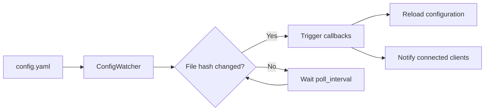

# Config Hot-Reload

Live configuration reloading — watch YAML config files for changes and apply updates **without restarting the server**.

## Quick Start

```bash
# Start the watcher
curl -X POST http://localhost:8083/api/config/watcher \
  -H "Content-Type: application/json" \
  -d '{"action": "start"}'

# Edit your YAML config file — changes apply automatically

# Check watcher status
curl http://localhost:8083/api/config/watcher
```

## How It Works



1. **ConfigWatcher** polls the config file at a configurable interval (default: 2 seconds)
2. On each poll, it computes the file's SHA-256 hash
3. If the hash differs from the previous check, it triggers all registered reload callbacks
4. Callbacks can update feature settings, re-register agents, or reload themes

## Configuration

```python
from praisonaiui.features.config_hot_reload import ConfigWatcher

watcher = ConfigWatcher(
    config_path=Path("./config.yaml"),  # File to watch
    poll_interval=2.0,                   # Seconds between polls
)

# Register a callback
@watcher.on_reload
def handle_reload(new_config):
    print(f"Config reloaded: {new_config}")

# Start watching
watcher.start()
```

## REST API

| Endpoint | Method | Description |
|----------|--------|-------------|
| `/api/config/watcher` | GET | Get watcher status |
| `/api/config/watcher` | POST | Start/stop the watcher |
| `/api/config/reload` | POST | Force a manual reload |

### Watcher Status

```bash
curl http://localhost:8083/api/config/watcher
```

```json
{
  "watching": true,
  "config_path": "/path/to/config.yaml",
  "poll_interval": 2.0,
  "last_reload": 1709734400.0,
  "reload_count": 3
}
```

### Force Reload

```bash
curl -X POST http://localhost:8083/api/config/reload
```

## Related

- [YAML Configuration](../concepts/configuration.md) — Config file format
- [Protocols](protocols.md) — Feature protocol system
