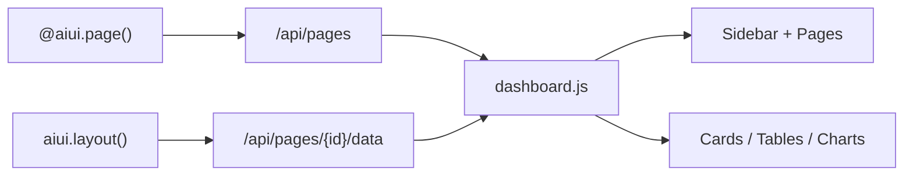
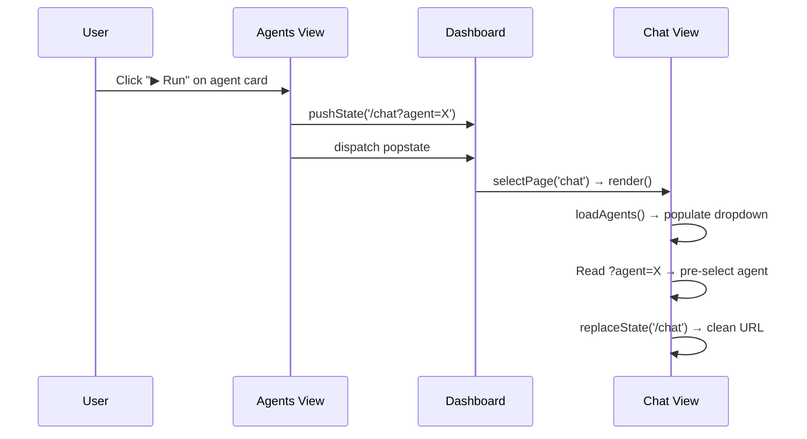

# Dashboard

Build rich admin panels with **zero HTML/CSS/JS**. Register pages from Python, compose UIs with the component API, and the SDK renders everything.

## Quick Start

```python
import praisonaiui as aiui
from praisonaiui.server import create_app

aiui.set_style("dashboard")

@aiui.page("analytics", title="Analytics", icon="📊")
async def analytics():
    return aiui.layout([
        aiui.columns([
            aiui.card("Users", value=142, footer="+12% this week"),
            aiui.card("Revenue", value="$1,500"),
        ]),
        aiui.table(
            headers=["Agent", "Tasks", "Status"],
            rows=[["Researcher", 15, "Active"]],
        ),
    ])

app = create_app()
```

```bash
aiui run app.py
# → Dashboard with sidebar, "Analytics" page with cards + table
```

## How It Works



1. **`@aiui.page()`** registers a page with the server
2. **`dashboard.js`** fetches `/api/pages`, builds the sidebar automatically
3. When a page is selected, it fetches `/api/pages/{id}/data`
4. If the data contains `_components`, they render as real UI elements (cards, tables, etc.)

## Registering Pages

### Basic Page

```python
@aiui.page("status", title="Status", icon="🟢")
async def status_page():
    return {"status": "healthy", "uptime": "99.9%"}
```

Pages without component layouts render as formatted JSON.

### Page with Components

```python
@aiui.page("metrics", title="Metrics", icon="📈", group="Monitoring")
async def metrics_page():
    return aiui.layout([
        aiui.columns([
            aiui.card("CPU", value="12%"),
            aiui.card("Memory", value="324 MB"),
            aiui.card("Disk", value="45 GB free"),
        ]),
        aiui.text("Last updated: 30 seconds ago"),
    ])
```

### Page Groups

Pages are grouped in the sidebar by the `group` parameter:

```python
@aiui.page("agents", title="Agents", icon="🤖", group="Agent")
@aiui.page("config", title="Config", icon="⚙️", group="Settings")
@aiui.page("logs",   title="Logs",   icon="📜", group="Settings")
```

| Parameter | Type | Required | Description |
|-----------|------|----------|-------------|
| `page_id` | `str` | ✅ | Unique identifier (URL-safe) |
| `title` | `str` | ✅ | Display name in sidebar |
| `icon` | `str` | ❌ | Emoji or icon character |
| `group` | `str` | ❌ | Sidebar group name |
| `description` | `str` | ❌ | Subtitle below the title |

## Component API

Build dashboard UIs entirely from Python — no HTML needed.

### Cards

Metric/stat cards for KPIs:

```python
aiui.card("Total Users", value=142, footer="+12% this week")
aiui.card("Revenue", value="$1,500")
aiui.card("Status", value="✓ Healthy")
```

### Columns

Arrange components side-by-side in a responsive grid:

```python
aiui.columns([
    aiui.card("Users", value=42),
    aiui.card("Tasks", value=18),
    aiui.card("Uptime", value="99.9%"),
])
```

### Tables

Data tables with headers and rows:

```python
aiui.table(
    headers=["Name", "Role", "Status"],
    rows=[
        ["Alice", "Engineer", "Active"],
        ["Bob", "Designer", "Idle"],
    ],
)
```

### Text

Simple text blocks:

```python
aiui.text("System metrics refresh every 30 seconds.")
```

### Charts

Chart placeholders (renders a titled container):

```python
aiui.chart("Revenue Over Time", data=[
    {"month": "Jan", "value": 1200},
    {"month": "Feb", "value": 1800},
], chart_type="line")
```

### Layout

Wrap all components in a layout container:

```python
aiui.layout([
    aiui.columns([...]),
    aiui.table(...),
    aiui.text("Footer note"),
])
```

The `layout()` function adds the `_components` key that tells the frontend to render structured components instead of raw JSON.

## Built-in Pages

When style is set to `dashboard`, **16 built-in pages** are auto-registered from the feature system:

| Page | Group | Description |
|------|-------|-------------|
| 🤖 Agents | Agent | Configured AI agents |
| ⚡ Skills | Agent | Agent tools and skills |
| 🖥️ Nodes | Agent | Execution nodes |
| 📊 Overview | Control | System overview |
| 📡 Channels | Control | Messaging channels |
| 📋 Sessions | Control | Active sessions |
| 📻 Instances | Control | Connected instances |
| 📈 Usage | Control | Token usage analytics |
| ⏰ Cron | Control | Scheduled jobs |
| 📋 Jobs | Control | Async job queue |
| ✅ Approvals | Control | Pending approvals |
| 🔌 API | Control | API documentation |
| ⚙️ Config | Settings | Runtime configuration |
| 🔐 Auth | Settings | Authentication |
| 📜 Logs | Settings | Real-time log viewer |
| 🐛 Debug | Settings | Debug information |

Custom pages added via `@aiui.page()` appear alongside built-in pages.

## Agent Run Button

Each agent card on the **Agents** page includes a **▶ Run** button. Clicking it navigates to the **Chat** page with that agent automatically pre-selected in the agent dropdown.

### How It Works



1. The Run button reads the agent name from its `data-id` attribute
2. It pushes `/chat?agent=<name>` to browser history and dispatches `popstate`
3. The dashboard's `popstate` listener calls `selectPage('chat')`, loading the Chat view
4. Chat's `render()` calls `loadAgents()`, then checks `URLSearchParams` for `?agent=`
5. If found, it sets the dropdown value and `currentAgentName`, then cleans the URL

## Test Panel

Every dashboard includes a **Test All Features** link at the bottom of the sidebar. It auto-discovers all registered features from `/api/features` and tests each endpoint, showing pass/fail results in a grid.

## Full Example

```python
import praisonaiui as aiui
from praisonaiui.server import create_app

aiui.set_style("dashboard")

@aiui.page("analytics", title="Analytics", icon="📊", group="Custom")
async def analytics():
    return aiui.layout([
        aiui.columns([
            aiui.card("Total Users", value=142, footer="+12% this week"),
            aiui.card("API Calls", value="3,847", footer="Last 24h"),
            aiui.card("Avg Latency", value="47ms", footer="-5ms"),
            aiui.card("Success Rate", value="99.2%", footer="✓ Healthy"),
        ]),
        aiui.table(
            headers=["Agent", "Tasks Completed", "Status"],
            rows=[
                ["Researcher", 15, "Active"],
                ["Code Writer", 8, "Idle"],
                ["Reviewer", 12, "Active"],
            ],
        ),
    ])

@aiui.page("metrics", title="Metrics", icon="📈", group="Custom")
async def metrics():
    return aiui.layout([
        aiui.columns([
            aiui.card("Uptime", value="99.97%"),
            aiui.card("Memory", value="324 MB"),
            aiui.card("CPU", value="12%"),
        ]),
        aiui.text("System metrics are refreshed every 30 seconds."),
    ])

app = create_app()

if __name__ == "__main__":
    import uvicorn
    uvicorn.run(app, host="0.0.0.0", port=8082)
```

## API Endpoints

| Endpoint | Method | Description |
|----------|--------|-------------|
| `/api/pages` | GET | List all registered pages |
| `/api/pages/{id}/data` | GET | Get page handler response |
| `/api/features` | GET | List all registered features |
| `/plugins/plugins.json` | GET | Style-aware frontend plugin list |
