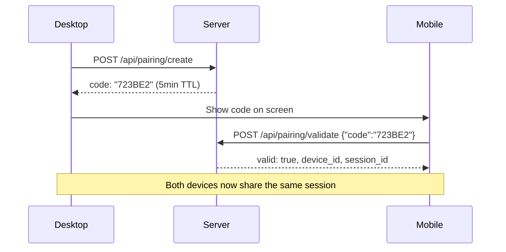

# Device Pairing

Pair devices to sessions using **short hex codes** — scan and sync across mobile, tablet, and desktop.

## Quick Start

```bash
# Generate a pairing code
curl -X POST http://localhost:8083/api/pairing/create \
  -H "Content-Type: application/json" \
  -d '{"session_id":"my-session"}'

# Validate and pair (from the other device)
curl -X POST http://localhost:8083/api/pairing/validate \
  -H "Content-Type: application/json" \
  -d '{"code":"A1B2C3"}'

# List paired devices
curl http://localhost:8083/api/pairing/devices?session_id=my-session
```

## How It Works



1. **Desktop** requests a pairing code for its session
2. Code is displayed on screen (6-char hex, 5-minute TTL)
3. **Mobile** enters the code to validate and pair
4. Server links the mobile device to the desktop's session
5. Both devices can now access the same conversation

### Security

- Codes are **single-use** — reusing returns `{"valid": false, "error": "Code already used"}`
- Codes **expire** after 5 minutes (configurable TTL)
- Max 5 devices per session (configurable)

## Configuration

```python
from praisonaiui.features.device_pairing import DefaultPairingManager, set_pairing_manager

mgr = DefaultPairingManager(
    code_ttl=600,       # 10-minute codes
    max_devices=10      # Allow more devices
)
set_pairing_manager(mgr)
```

## REST API

| Endpoint | Method | Description |
|----------|--------|-------------|
| `/api/pairing/create` | POST | Generate a pairing code |
| `/api/pairing/validate` | POST | Validate and consume a code |
| `/api/pairing/devices` | GET | List paired devices for session |
| `/api/pairing/devices/{id}` | DELETE | Remove a paired device |

### POST /api/pairing/create

```json
// Request
{"session_id": "my-session"}

// Response (201)
{"code": "723BE2", "session_id": "my-session",
 "created_at": 1772834103.42, "expires_at": 1772834403.42, "used": false}
```

### POST /api/pairing/validate

```json
// Request
{"code": "723BE2"}

// Response (valid)
{"valid": true, "device_id": "f408fdebd954d8da", "session_id": "my-session"}

// Response (reused → 400)
{"valid": false, "error": "Code already used"}
```

## Related

- [Sessions](sessions.md) — Sessions that paired devices share
