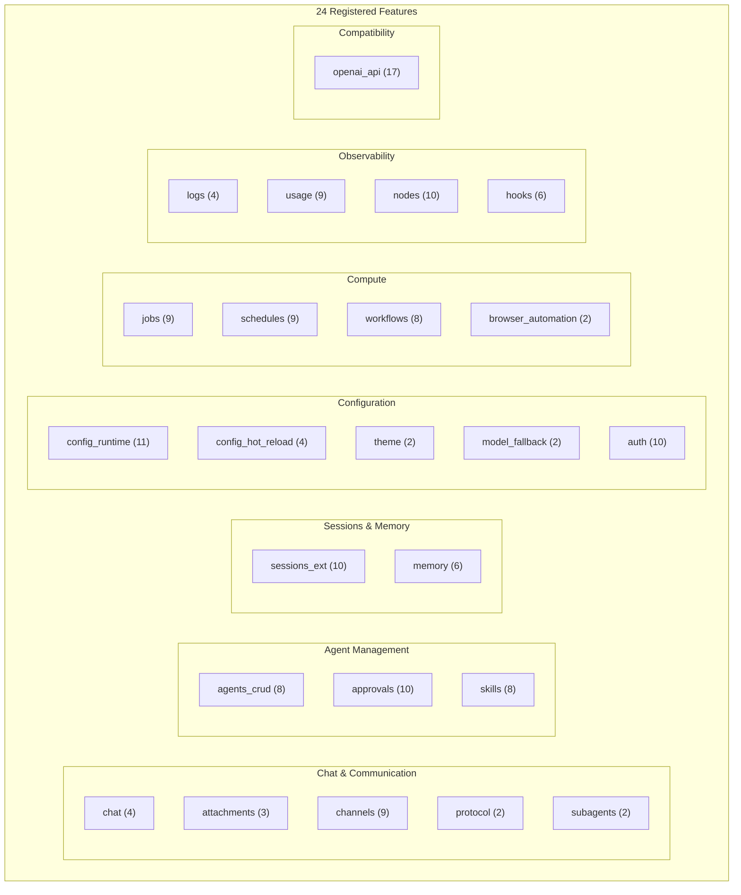

# Feature Inventory

> **Last validated**: 2026-03-06 — programmatically verified against running codebase

Complete inventory of **every feature** in PraisonAIUI: what's implemented, what's partial, and what's missing.

---

## Summary Scorecard

| Category | Count |
|----------|-------|
| ✅ Fully Implemented Features | **24** |
| 🟡 Partial (needs integration) | **4** |
| 🔴 Not Yet Built | **5** |
| Total API Routes | **164** |
| Features with CLI Commands | **14** |
| Frontend Dashboard Views | **12** |
| Backend Health: Healthy | **23 / 24** |
| Backend Health: Degraded | **1 / 24** (openai_api — needs `praisonai.capabilities`) |

---

## All Implemented Features (Validated ✅)

These features are **registered, healthy, and serving API routes** right now.

| # | Feature Name | Description | Routes | CLI | Health | Frontend View | Source File |
|---|-------------|-------------|--------|-----|--------|--------------|------------|
| 1 | `agents_crud` | Agent create, update, delete management | 8 | ✅ | ✅ ok | `agents.js` | `agents.py` |
| 2 | `approvals` | Tool-execution approval management | 10 | ✅ | ✅ ok | `approvals.js` | `approvals.py` |
| 3 | `attachments` | File upload and attachment management for chat | 3 | ❌ | ✅ ok | — | `attachments.py` |
| 4 | `auth` | Multi-mode authentication (API key, session, password) | 10 | ✅ | ✅ ok | — | `auth.py` |
| 5 | `browser_automation` | Browser automation via CDP/Playwright | 2 | ❌ | ✅ ok | — | `browser_automation.py` |
| 6 | `channels` | Multi-platform messaging channels (Discord, Slack, Telegram, etc.) | 9 | ✅ | ✅ ok | `channels.js` | `channels.py` |
| 7 | `chat` | Real-time agent chat with WebSocket streaming | 4 | ❌ | ✅ ok | `chat.js` | `chat.py` |
| 8 | `config_hot_reload` | File-watcher for live config changes | 4 | ❌ | ✅ ok | — | `config_hot_reload.py` |
| 9 | `config_runtime` | Live runtime configuration (get, set, patch) | 11 | ✅ | ✅ ok | `config.js` | `config_runtime.py` |
| 10 | `hooks` | Pre/post operation hook management | 6 | ✅ | ✅ ok | — | `hooks.py` |
| 11 | `jobs` | Async job submission and monitoring | 9 | ✅ | ✅ ok | — | `jobs.py` |
| 12 | `logs` | Real-time log streaming with WebSocket | 4 | ✅ | ✅ ok | `logs.js` | `logs.py` |
| 13 | `memory` | Agent memory management (short, long, entity) | 6 | ✅ | ✅ ok | — | `memory.py` |
| 14 | `model_fallback` | Model fallback chain configuration | 2 | ❌ | ✅ ok | — | `model_fallback.py` |
| 15 | `nodes` | Execution nodes and connected instances | 10 | ✅ | ✅ ok | `nodes.js` | `nodes.py` |
| 16 | `openai_api` | OpenAI-compatible API (`/v1/*`) | 17 | ✅ | ⚠️ degraded | — | `openai_api.py` |
| 17 | `protocol` | WebSocket protocol versioning and negotiation | 2 | ❌ | ✅ ok | — | `protocol_version.py` |
| 18 | `schedules` | Scheduled job management (cron, interval, one-shot) | 9 | ✅ | ✅ ok | `schedules.js` | `schedules.py` |
| 19 | `sessions_ext` | Extended session management (state, context, labels) | 10 | ✅ | ✅ ok | `sessions.js` | `sessions_ext.py` |
| 20 | `skills` | Agent tool and skill management | 8 | ✅ | ✅ ok | `skills.js` | `skills.py` |
| 21 | `subagents` | Subagent spawning tree view and hierarchy | 2 | ❌ | ✅ ok | — | `subagents.py` |
| 22 | `theme` | Theme system with light/dark/custom support | 2 | ❌ | ✅ ok | — | `theme.py` |
| 23 | `usage` | Token usage and cost analytics | 9 | ✅ | ✅ ok | `usage.js` | `usage.py` |
| 24 | `workflows` | Multi-step workflow management (Pipeline, Route, Parallel, Loop) | 8 | ✅ | ✅ ok | — | `workflows.py` |

---

## Frontend Dashboard Views (12 Views)

All located in `src/praisonaiui/templates/frontend/plugins/views/`:

| View | File | Routes It Consumes |
|------|------|--------------------|
| Overview | `overview.js` | Aggregates from multiple features |
| Agents | `agents.js` | `/api/agents/definitions/*` |
| Approvals | `approvals.js` | `/api/approvals/*` |
| Channels | `channels.js` | `/api/channels/*` |
| Chat | `chat.js` | `/api/chat/*` (WebSocket + REST) |
| Config | `config.js` | `/api/config/runtime/*` |
| Logs | `logs.js` | `/api/logs/*` (WebSocket) |
| Nodes | `nodes.js` | `/api/nodes/*`, `/api/instances/*` |
| Schedules | `schedules.js` | `/api/schedules/*` |
| Sessions | `sessions.js` | `/api/sessions/*` |
| Skills | `skills.js` | `/api/skills/*` |
| Usage | `usage.js` | `/api/usage/*` |

---

## API Route Inventory (164 Routes)

### Chat & Communication (20 routes)

| Endpoint | Method | Feature |
|----------|--------|---------|
| `/api/chat/send` | POST | chat |
| `/api/chat/history/{session_id}` | GET | chat |
| `/api/chat/abort` | POST | chat |
| `/api/chat/ws` | WebSocket | chat |
| `/api/chat/attachments` | POST | attachments |
| `/api/chat/attachments/{session_id}` | GET | attachments |
| `/api/chat/attachments/{attachment_id}` | DELETE | attachments |
| `/api/channels` | GET | channels |
| `/api/channels` | POST | channels |
| `/api/channels/platforms` | GET | channels |
| `/api/channels/{channel_id}` | GET | channels |
| `/api/channels/{channel_id}` | PUT | channels |
| `/api/channels/{channel_id}` | DELETE | channels |
| `/api/channels/{channel_id}/toggle` | POST | channels |
| `/api/channels/{channel_id}/status` | GET | channels |
| `/api/channels/{channel_id}/restart` | POST | channels |
| `/api/protocol` | GET | protocol |
| `/api/protocol/negotiate` | POST | protocol |
| `/api/subagents` | GET | subagents |
| `/api/subagents/{session_id}` | GET | subagents |

### Agent Management (18 routes)

| Endpoint | Method | Feature |
|----------|--------|---------|
| `/api/agents/definitions` | GET | agents_crud |
| `/api/agents/definitions` | POST | agents_crud |
| `/api/agents/definitions/{agent_id}` | GET | agents_crud |
| `/api/agents/definitions/{agent_id}` | PUT | agents_crud |
| `/api/agents/definitions/{agent_id}` | DELETE | agents_crud |
| `/api/agents/models` | GET | agents_crud |
| `/api/agents/duplicate/{agent_id}` | POST | agents_crud |
| `/api/agents/run/{agent_id}` | POST | agents_crud |
| `/api/approvals` | GET | approvals |
| `/api/approvals` | POST | approvals |
| `/api/approvals/pending` | GET | approvals |
| `/api/approvals/history` | GET | approvals |
| `/api/approvals/policies` | GET | approvals |
| `/api/approvals/policies` | POST | approvals |
| `/api/approvals/stream` | WebSocket | approvals |
| `/api/approvals/{approval_id}` | GET | approvals |
| `/api/approvals/{approval_id}/approve` | POST | approvals |
| `/api/approvals/{approval_id}/deny` | POST | approvals |

### Session & Memory (16 routes)

| Endpoint | Method | Feature |
|----------|--------|---------|
| `/api/sessions` | GET | sessions_ext |
| `/api/sessions/{session_id}/state` | GET | sessions_ext |
| `/api/sessions/{session_id}/state` | PUT | sessions_ext |
| `/api/sessions/{session_id}/context` | GET | sessions_ext |
| `/api/sessions/{session_id}/compact` | POST | sessions_ext |
| `/api/sessions/{session_id}/reset` | POST | sessions_ext |
| `/api/sessions/{session_id}/preview` | GET | sessions_ext |
| `/api/sessions/{session_id}/labels` | GET | sessions_ext |
| `/api/sessions/{session_id}/labels` | PUT | sessions_ext |
| `/api/sessions/{session_id}/usage` | GET | sessions_ext |
| `/api/memory` | GET | memory |
| `/api/memory` | POST | memory |
| `/api/memory` | DELETE | memory |
| `/api/memory/search` | POST | memory |
| `/api/memory/{memory_id}` | GET | memory |
| `/api/memory/{memory_id}` | DELETE | memory |

### Configuration & Infrastructure (33 routes)

| Endpoint | Method | Feature |
|----------|--------|---------|
| `/api/config/runtime` | GET | config_runtime |
| `/api/config/runtime` | PUT | config_runtime |
| `/api/config/runtime` | PATCH | config_runtime |
| `/api/config/runtime/history` | GET | config_runtime |
| `/api/config/runtime/{key}` | GET | config_runtime |
| `/api/config/runtime/{key}` | PUT | config_runtime |
| `/api/config/runtime/{key}` | DELETE | config_runtime |
| `/api/config/schema` | GET | config_runtime |
| `/api/config/validate` | POST | config_runtime |
| `/api/config/apply` | POST | config_runtime |
| `/api/config/defaults` | POST | config_runtime |
| `/api/config/watcher` | GET | config_hot_reload |
| `/api/config/watcher/start` | POST | config_hot_reload |
| `/api/config/watcher/stop` | POST | config_hot_reload |
| `/api/config/reload` | POST | config_hot_reload |
| `/api/auth/status` | GET | auth |
| `/api/auth/config` | GET | auth |
| `/api/auth/config` | PUT | auth |
| `/api/auth/keys` | GET | auth |
| `/api/auth/keys` | POST | auth |
| `/api/auth/keys/{key_id}` | DELETE | auth |
| `/api/auth/login` | POST | auth |
| `/api/auth/logout` | POST | auth |
| `/api/auth/sessions` | GET | auth |
| `/api/auth/password` | POST | auth |
| `/api/theme` | GET | theme |
| `/api/theme` | PUT | theme |
| `/api/models` | GET | model_fallback |
| `/api/models/fallback` | PUT | model_fallback |
| `/api/browser/status` | GET | browser_automation |
| `/api/browser/run` | POST | browser_automation |
| `/api/hooks` | GET | hooks |
| `/api/hooks` | POST | hooks |

### Jobs, Schedules & Workflows (26 routes)

| Endpoint | Method | Feature |
|----------|--------|---------|
| `/api/jobs` | GET | jobs |
| `/api/jobs` | POST | jobs |
| `/api/jobs/stats` | GET | jobs |
| `/api/jobs/{job_id}` | GET | jobs |
| `/api/jobs/{job_id}` | DELETE | jobs |
| `/api/jobs/{job_id}/status` | GET | jobs |
| `/api/jobs/{job_id}/result` | GET | jobs |
| `/api/jobs/{job_id}/cancel` | POST | jobs |
| `/api/jobs/{job_id}/stream` | WebSocket | jobs |
| `/api/schedules` | GET | schedules |
| `/api/schedules` | POST | schedules |
| `/api/schedules/{job_id}` | GET | schedules |
| `/api/schedules/{job_id}` | PUT | schedules |
| `/api/schedules/{job_id}` | DELETE | schedules |
| `/api/schedules/{job_id}/toggle` | POST | schedules |
| `/api/schedules/{job_id}/run` | POST | schedules |
| `/api/schedules/{job_id}/stop` | POST | schedules |
| `/api/schedules/{job_id}/stats` | GET | schedules |
| `/api/workflows` | GET | workflows |
| `/api/workflows` | POST | workflows |
| `/api/workflows/runs` | GET | workflows |
| `/api/workflows/runs/{run_id}` | GET | workflows |
| `/api/workflows/{workflow_id}` | GET | workflows |
| `/api/workflows/{workflow_id}` | DELETE | workflows |
| `/api/workflows/{workflow_id}/run` | POST | workflows |
| `/api/workflows/{workflow_id}/status` | GET | workflows |

### OpenAI-Compatible API (17 routes)

| Endpoint | Method | Feature |
|----------|--------|---------|
| `/v1` | GET | openai_api |
| `/v1/chat/completions` | POST | openai_api |
| `/v1/completions` | POST | openai_api |
| `/v1/embeddings` | POST | openai_api |
| `/v1/images/generations` | POST | openai_api |
| `/v1/audio/transcriptions` | POST | openai_api |
| `/v1/audio/speech` | POST | openai_api |
| `/v1/moderations` | POST | openai_api |
| `/v1/models` | GET | openai_api |
| `/v1/models/{model_id}` | GET | openai_api |
| `/v1/responses` | POST | openai_api |
| `/v1/files` | GET | openai_api |
| `/v1/files` | POST | openai_api |
| `/v1/files/{file_id}` | GET | openai_api |
| `/v1/files/{file_id}` | DELETE | openai_api |
| `/v1/assistants` | GET | openai_api |
| `/v1/assistants` | POST | openai_api |

### Observability (17 routes)

| Endpoint | Method | Feature |
|----------|--------|---------|
| `/api/logs/stream` | WebSocket | logs |
| `/api/logs/levels` | GET | logs |
| `/api/logs/clear` | POST | logs |
| `/api/logs/stats` | GET | logs |
| `/api/usage` | GET | usage |
| `/api/usage/summary` | GET | usage |
| `/api/usage/details` | GET | usage |
| `/api/usage/models` | GET | usage |
| `/api/usage/sessions` | GET | usage |
| `/api/usage/agents` | GET | usage |
| `/api/usage/timeseries` | GET | usage |
| `/api/usage/costs` | GET | usage |
| `/api/usage/track` | POST | usage |
| `/api/nodes` | GET | nodes |
| `/api/nodes` | POST | nodes |
| `/api/nodes/instances` | GET | nodes |
| `/api/instances` | GET | nodes |

---

## Partially Implemented (Need UI Integration) 🟡

| Feature | SDK Status | UI Status | What's Left |
|---------|-----------|-----------|-------------|
| `memory` (Gap 11) | ✅ SDK: `Memory` class (1,874 lines), FileMemory, ChromaDB, MongoDB, Mem0, `Agent.get_memory_context()` | praisonaiui uses in-memory dict | Wire UI `memory.py` to SDK's `Memory` class; add memory sidebar in chat |
| `channels` (Gap 12) | ✅ SDK: DiscordBot (487), TelegramBot (710), SlackBot (593), WhatsAppBot (959) | 9 routes, config-only | Wire UI to launch SDK bots; 4 niche channels (Signal, iMessage, Google Chat, Nostr) not yet built |
| `skills` → Code Execution (Gap 16) | ✅ SDK: `execute_code` tool with sandbox | No dedicated editor page | Add code editor page (Monaco/CodeMirror) |
| `openai_api` → TTS (Gap 21) | 🟡 SDK: Bots have TTS, `stt_tool` exists, no standalone `tts_tool` | `/v1/audio/speech` endpoint | Add `tts_tool` to SDK; add 🔊 button in chat UI |
| `attachments` → Vision (Gap 23) | ✅ SDK: VisionAgent (449 lines), OCRAgent (298 lines) | Attachments can upload images | Wire image attachments to VisionAgent for inline analysis |

---

## Not Yet Built 🔴

| Feature | Gap # | What Needs to Be Built |
|---------|-------|------------------------|
| Plugin Marketplace | 13 | Marketplace UI, plugin registry, one-click install (UI-only — SDK has plugin system) |
| i18n Framework | 18 | Translation framework, locale files, language switcher (UI-only) |
| PWA / Mobile | 20 | `manifest.json`, service worker, responsive CSS, app icons (UI-only) |
| Device Pairing | 24 | Pairing protocol (QR/short code), session sync, device management (UI-only) |

---

## Feature Architecture

> Numbers in parentheses = API route count per feature
