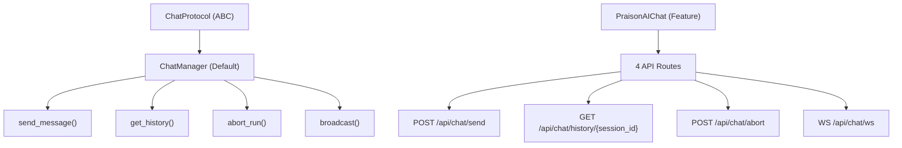
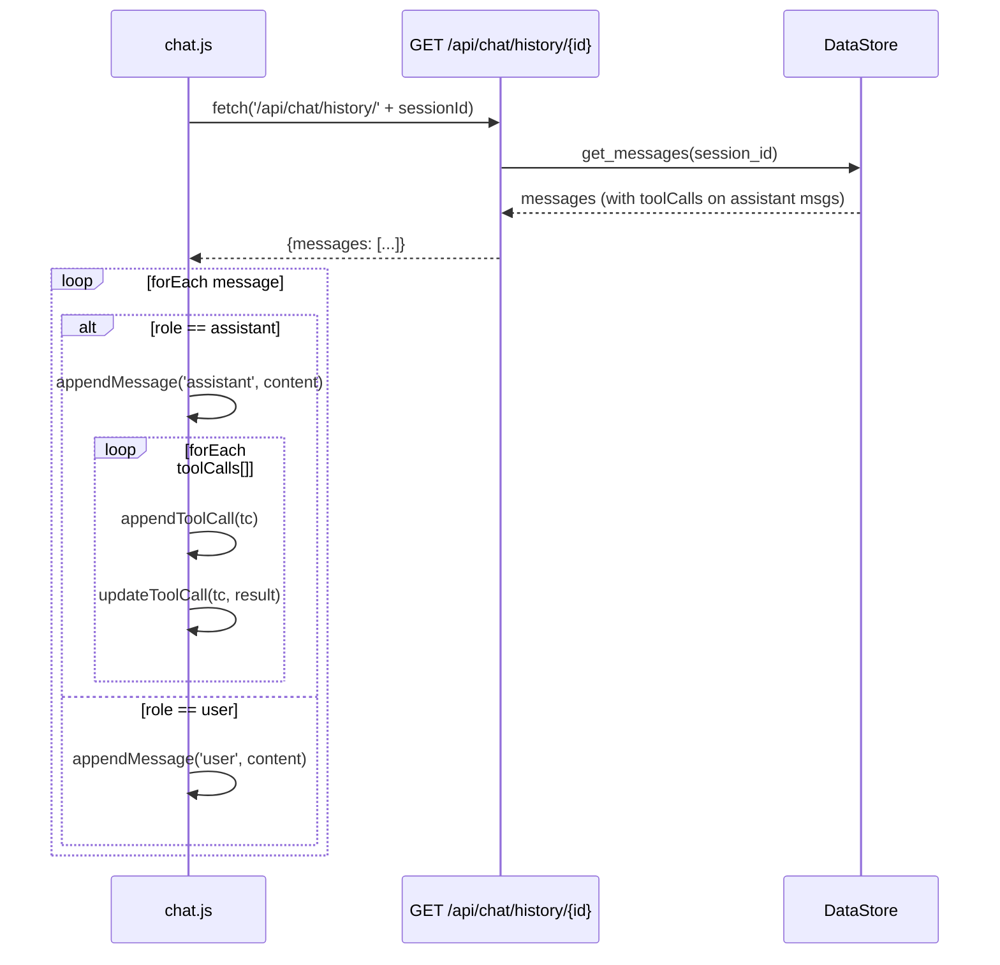

# Gateway Chat

Real-time AI agent chat with **WebSocket streaming**, markdown rendering, tool call display, and session management.


## Quick Start

```python
import praisonaiui as aiui
from praisonaiui.server import create_app

aiui.set_style("dashboard")
app = create_app()

# Chat is auto-registered — just start the server
# Navigate to the dashboard and open the Chat page
```

```bash
aiui run app.py
# → Dashboard with Chat page, WebSocket streaming, and session management
```

## How It Works

### Full Streaming Data Flow

A chat message travels through 5 layers before reaching the browser:

```mermaid
sequenceDiagram
    participant U as User (Browser)
    participant JS as chat.js
    participant WS as WebSocket /api/chat/ws
    participant CM as ChatManager<br/>(chat.py)
    participant PR as PraisonAIProvider<br/>(providers/__init__.py)
    participant SDK as Agent.chat()<br/>(praisonaiagents)

    U->>JS: User types message, hits Send
    JS->>WS: {type: "chat", content: "Hello"}
    WS->>CM: _run_and_broadcast(session_id, content)
    CM->>PR: provider.run(content, session_id)
    PR->>SDK: agent.chat(message, stream=True)

    rect rgb(40, 40, 60)
    note over SDK,JS: Streaming Phase
    SDK-->>PR: StreamEvent (DELTA_TEXT tokens)
    PR-->>CM: RunEvent(RUN_CONTENT, token="...")
    CM-->>WS: broadcast({type: "run_content", token: "..."})
    JS->>JS: appendDelta(token) — accumulate in single DOM element

    SDK-->>PR: StreamEvent (TOOL_CALL_START)
    PR-->>CM: RunEvent(TOOL_CALL_STARTED, name, args)
    CM->>CM: Dedup + enrich (icon, description, step_number)
    CM-->>WS: broadcast({type: "tool_call_started", ...enriched})
    JS->>JS: appendToolCall(data, 'running') — collapsible card

    SDK-->>PR: StreamEvent (TOOL_CALL_END + result)
    PR-->>CM: RunEvent(TOOL_CALL_COMPLETED, result)
    CM->>CM: Merge result into collected_tool_calls
    CM-->>WS: broadcast({type: "tool_call_completed", ...enriched})
    JS->>JS: updateToolCall(data, 'done') — show ✓ + result

    SDK-->>PR: StreamEvent (STREAM_END)
    PR-->>CM: RunEvent(RUN_COMPLETED, content=str(response))
    CM-->>WS: broadcast({type: "run_completed", content: "..."})
    JS->>JS: finalizeDelta(content) — replace streaming text with final
    end

    rect rgb(40, 50, 40)
    note over CM: Persistence Phase
    CM->>CM: Save to datastore: {role, content, toolCalls}
    end
```



### Key Files

| File | Layer | Responsibility |
|------|-------|----------------|
| `aiui/plugins/views/chat.js` | Frontend | WS connection, DOM rendering, session history |
| `src/praisonaiui/features/chat.py` | Backend | ChatManager, `_run_and_broadcast`, history API |
| `src/praisonaiui/server.py` | Backend | SSE streaming path (`run_agent` endpoint) |
| `src/praisonaiui/providers/__init__.py` | Provider | SDK → RunEvent bridge, `_run_direct_mode` |
| `src/praisonaiui/datastore.py` | Storage | `MemoryDataStore` / `JSONFileDataStore` |
| `src/praisonaiui/provider.py` | Protocol | `RunEventType` enum definition |

## Architecture



## Agent Tool Resolution

Agents created via YAML config, CRUD API, jobs, or channel bots automatically get tools resolved through the `ToolResolver`. Tool names in config are resolved to callable Python functions from 4 sources:

1. Local `tools.py` file (backward compatibility)
2. `praisonaiagents.tools.TOOL_MAPPINGS` (built-in tools)
3. `praisonai_tools` package (community tools)
4. Tool registry (programmatically registered tools)

### YAML Configuration

```yaml
# ~/.praisonaiui/config.yaml (unified runtime config)
agents:
  researcher:
    instructions: "Research topics thoroughly."
    model: gpt-4o-mini
    tools:
      - internet_search        # Resolved to callable function
      - wikipedia_search
    reflection: true            # Enable self-reflection (default: true)
    role: "Senior Researcher"   # Optional CrewAI-style params
    goal: "Find accurate info"
    backstory: "Expert researcher"
```

### CRUD API

Agents created via `POST /api/agents` also support tools:

```json
{
  "name": "researcher",
  "instructions": "Research topics thoroughly.",
  "model": "gpt-4o-mini",
  "tools": ["internet_search"],
  "reflection": true
}
```

### Where Tool Resolution Applies

| Component | Tool Resolution |
|-----------|----------------|
| Gateway `_create_agents_from_config()` | ✅ `ToolResolver` |
| Integration `create_gateway_from_yaml()` | ✅ `ToolResolver` |
| Provider `_get_or_create_agent()` | ✅ Default tools |
| Channel bot `_start_channel_bot()` | ✅ Default tools |
| Jobs `_execute_job()` fallback | ✅ `ToolResolver` |
| CRUD agents `_run()` fallback | ✅ `ToolResolver` |
| CRUD agents `_sync_to_gateway()` | ✅ `ToolResolver` |

## Features

### Markdown Rendering

Assistant messages are rendered with full markdown support:

- **Bold**, *italic*, ~~strikethrough~~
- Inline `code` and fenced code blocks with syntax highlighting
- Ordered and unordered lists
- Links (auto-detected and rendered safely)

### Tool Call Display


When agents use tools, each call is displayed as a collapsible card:

- Tool name and status indicator (running/completed/failed)
- Input arguments (JSON)
- Output results (rendered in code blocks)

#### Tool Call Lifecycle

Tool calls go through 4 stages: **emit → enrich → dedup → persist**.

**1. Emit** — The SDK fires `TOOL_CALL_START` / `DELTA_TOOL_CALL` / `TOOL_CALL_END` events via `StreamEventEmitter`. The provider maps these to `RunEvent` types (`TOOL_CALL_STARTED`, `TOOL_CALL_COMPLETED`).

**2. Enrich** — `_run_and_broadcast()` in `chat.py` enriches each tool call event with display-friendly fields via `_enrich_tool_payload()`:

| Field | Source | Example |
|-------|--------|---------|
| `icon` | Mapped from tool name | 🔍, 📝, 💾 |
| `description` | Generated from name + args | "🔍 Searching for 'Django latest version'" |
| `step_number` | Auto-incrementing counter per run | 1, 2, 3 |
| `formatted_result` | Truncated result string | "✓ Done" |
| `tool_call_id` | SDK-assigned or UUID fallback | "call_abc123" |

**3. Dedup** — Both `DELTA_TOOL_CALL` (stream) and hook callbacks fire for the same tool call. The handler uses `_seen_tool_started` / `_seen_tool_completed` sets keyed by `tool_call_id` and `name` to suppress duplicates. A re-broadcast with `has_complete_args=True` is allowed to update the description with keyword-rich text.

**4. Persist** — After the run completes, all enriched tool calls are merged by `tool_call_id` into `collected_tool_calls` and saved alongside the assistant message:

```python
msg_data = {
    "role": "assistant",
    "content": full_response,
}
if collected_tool_calls:
    msg_data["toolCalls"] = list(collected_tool_calls.values())
await _datastore.add_message(session_id, msg_data)
```

#### Tool Call Persistence Schema

Tool calls are persisted alongside assistant messages in the datastore. When a session is reloaded from history, tool call steps are reconstructed from the `toolCalls` array on each assistant message.

Assistant message schema in the datastore:

```json
{
  "role": "assistant",
  "content": "Final response text",
  "toolCalls": [
    {
      "name": "search_web",
      "description": "🔍 Searching for 'Django latest version'",
      "icon": "🔍",
      "step_number": 1,
      "args": {"query": "Django latest version"},
      "result": "...",
      "formatted_result": "✓ Done",
      "status": "done",
      "tool_call_id": "tc_abc123",
      "type": "tool_call_completed"
    }
  ]
}
```

#### History Reload Rendering



### Session Management

- **New Session**: Click "New Chat" to create a fresh session
- **Session History**: Switch between sessions in the sidebar
- **Message History**: Full conversation history per session via REST API

### Message Abort

- Click the **Stop** button (or send `chat_abort` via WebSocket) to cancel an in-progress agent run
- The partial response is preserved in history

### File Attachments

Upload files to include with your chat messages — see [Attachments](attachments.md) for details.

## Session Persistence

Chat history is persisted via the `BaseDataStore` interface (`datastore.py`). Two implementations are available:

| DataStore | Persistence | Default |
|-----------|-------------|--------|
| `MemoryDataStore` | Volatile (in-memory only) | Yes (fallback) |
| `JSONFileDataStore` | Disk (`~/.praisonaiui/sessions/`) | Yes (when `data_dir` configured) |

Each session is a JSON file containing:

```json
{
  "id": "session-uuid",
  "title": "Auto-generated from first user message",
  "created_at": "2026-03-17T08:00:00Z",
  "updated_at": "2026-03-17T08:01:00Z",
  "messages": [
    {"role": "user", "content": "..."},
    {"role": "assistant", "content": "...", "toolCalls": [...]}
  ]
}
```

Messages are appended via `add_message()` and retrieved via `get_messages()`. Both methods are `async` to support future database backends.

### Response Content Strategy

The `content` field on assistant messages stores the SDK's final response from `agent.chat()` — the same text displayed by `finalizeDelta()` in the live view. This ensures the reloaded view matches what the user saw during streaming.

> [!IMPORTANT]
> During streaming, text tokens are accumulated in `full_response`. However, when `RUN_COMPLETED` arrives with `event.content` (the SDK's authoritative return value), it **replaces** the accumulated tokens for storage. This prevents intermediate narrative text from being duplicated on reload.

## Chat Message Model

```python
@dataclass
class ChatMessage:
    role: str              # "user" | "assistant" | "system"
    content: str           # Message text
    session_id: str        # Session identifier
    message_id: str        # Auto-generated UUID
    agent_name: str        # Optional agent name
    timestamp: float       # Unix timestamp
    metadata: Dict         # Optional metadata (tool calls, etc.)
```

## WebSocket Protocol

### Client → Server

```json
// Send a message
{"type": "chat", "content": "Hello!", "session_id": "abc-123"}

// Abort a run
{"type": "chat_abort", "session_id": "abc-123"}

// Keepalive ping
{"type": "ping"}
```

### Server → Client

All events include `session_id` and `run_id`.

```json
// Streaming text token
{"type": "run_content", "token": "Hello", "session_id": "...", "run_id": "..."}

// Tool call started (enriched)
{
  "type": "tool_call_started",
  "name": "search_web",
  "tool_call_id": "call_abc123",
  "args": {"query": "Django"},
  "description": "🔍 Searching for 'Django'",
  "icon": "🔍",
  "step_number": 1
}

// Tool call completed (enriched)
{
  "type": "tool_call_completed",
  "tool_call_id": "call_abc123",
  "name": "search_web",
  "result": "Django 5.1 released...",
  "formatted_result": "✓ Done",
  "status": "done"
}

// Intermediate LLM narrative text (between tool calls)
{"type": "llm_content", "content": "Let me search for that..."}

// Reasoning step (thinking)
{"type": "reasoning_step", "step": "Analyzing the query..."}

// Agent asks for user input
{"type": "run_paused", "question": "Which version?", "options": ["5.0", "5.1"]}

// Memory updates
{"type": "memory_update_started"}
{"type": "updating_memory"}
{"type": "memory_update_completed"}

// Run completed (content = SDK's final response)
{"type": "run_completed", "content": "Here are the results..."}

// Error / Cancel
{"type": "run_error", "error": "..."}
{"type": "run_cancelled"}

// Team variants (multi-agent)
{"type": "team_run_started", "agent_name": "researcher"}
{"type": "team_run_content", "token": "..."}
{"type": "team_tool_call_started", ...}
{"type": "team_tool_call_completed", ...}
{"type": "team_run_completed", "content": "..."}

// Channel bot messages
{"type": "channel_message", "platform": "slack", "sender": "User", "content": "..."}
{"type": "channel_response", "platform": "slack", "content": "..."}

// Keepalive
{"type": "pong"}
```

## REST API

| Endpoint | Method | Description |
|----------|--------|-------------|
| `/api/chat/send` | POST | Send a message (non-streaming) |
| `/api/chat/history/{session_id}` | GET | Get message history for a session |
| `/api/chat/abort` | POST | Abort an active run |
| `/api/chat/ws` | WebSocket | Real-time chat streaming |

### Send Message

```bash
curl -X POST http://localhost:8083/api/chat/send \
  -H "Content-Type: application/json" \
  -d '{"content": "Hello!", "session_id": "my-session"}'
```

### Get History

```bash
curl http://localhost:8083/api/chat/history/my-session
```

Response includes `toolCalls` on assistant messages:

```json
{
  "messages": [
    {"role": "user", "content": "Search for Django"},
    {
      "role": "assistant",
      "content": "Here are the results...",
      "toolCalls": [
        {
          "name": "search_web",
          "description": "🔍 Searching for 'Django'",
          "step_number": 1,
          "status": "done",
          "result": "..."
        }
      ]
    }
  ]
}

## Frontend (chat.js)

The chat frontend is a vanilla JavaScript plugin that auto-loads as a dashboard page. Two versions exist:

| Version | Path | Notes |
|---------|------|-------|
| Plugin | `aiui/plugins/views/chat.js` | Used in development |
| Template | `src/praisonaiui/templates/frontend/plugins/views/chat.js` | Bundled with package, has enriched UI |

### Core Functions

| Function | Purpose |
|----------|--------|
| `connectWebSocket()` | Establish WS with auto-reconnect (3s delay) |
| `handleWsMessage(data)` | Event dispatch — routes to rendering functions |
| `appendMessage(role, content, agentName)` | Render a complete message (history load) |
| `appendDelta(token, agentName)` | Streaming — append token to `currentDeltaEl` |
| `finalizeDelta(content, agentName)` | End streaming — replace with final content |
| `appendToolCall(name/data, args/status)` | Render tool call card |
| `updateToolCall(name/data, result, status)` | Update card with result |
| `appendReasoning(step)` | Render thinking step |
| `appendAskWidget(question, options)` | Render user-input prompt |
| `appendMemoryIndicator(text)` | Show memory update spinner |
| `loadSession(sessionId)` | Fetch history → render messages + tool calls |
| `restoreSessionHistory(sessionId)` | Same as above, on WS reconnect |
| `renderMarkdown(text)` | Custom zero-dependency markdown renderer |
| `escapeHtml(str)` | XSS prevention sanitizer |

### Streaming Text Model

During streaming, **all text tokens go into a single `currentDeltaEl` DOM element** — even across tool call boundaries. Tool call cards are sibling elements inserted alongside the text element. When `run_completed` arrives, `finalizeDelta(content)` **replaces** the accumulated text with the SDK's final response.

## Theming

The chat UI supports dark and light themes via CSS custom properties — see [Theme System](theme-system.md).

## Related

- [Attachments](attachments.md) — File uploads in chat
- [Theme System](theme-system.md) — Dark/light mode
- [Protocol Versioning](protocol-versioning.md) — WebSocket protocol negotiation
- [Subagent Tree](subagent-tree.md) — Agent hierarchy visualization
