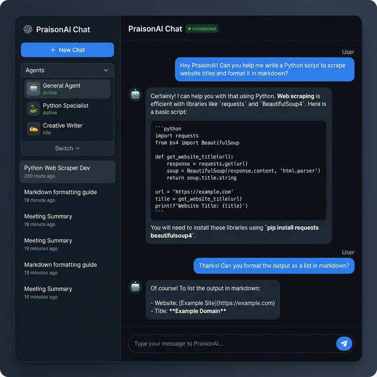
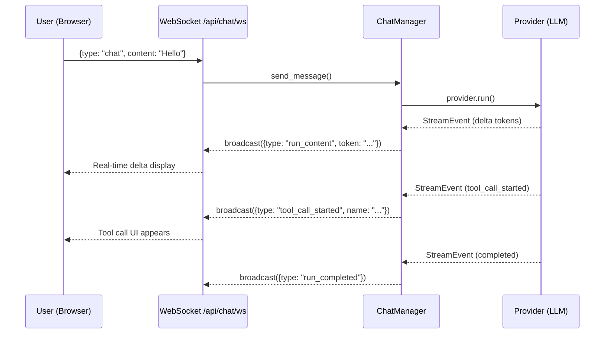
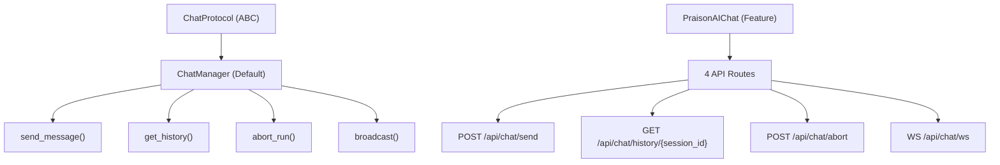
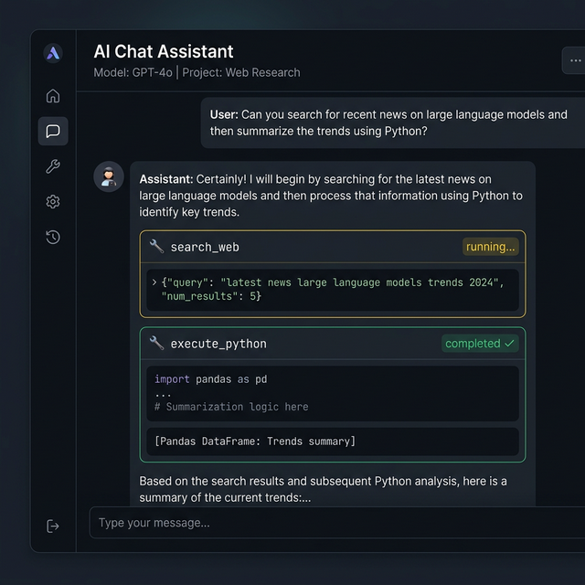

# Gateway Chat

Real-time AI agent chat with **WebSocket streaming**, markdown rendering, tool call display, and session management.



## Quick Start

```python
import praisonaiui as aiui
from praisonaiui.server import create_app

aiui.set_style("dashboard")
app = create_app()

# Chat is auto-registered — just start the server
# Navigate to the dashboard and open the Chat page
```

```bash
aiui run app.py
# → Dashboard with Chat page, WebSocket streaming, and session management
```

## How It Works



## Architecture



## Agent Tool Resolution

Agents created via YAML config, CRUD API, jobs, or channel bots automatically get tools resolved through the `ToolResolver`. Tool names in config are resolved to callable Python functions from 4 sources:

1. Local `tools.py` file (backward compatibility)
2. `praisonaiagents.tools.TOOL_MAPPINGS` (built-in tools)
3. `praisonai_tools` package (community tools)
4. Tool registry (programmatically registered tools)

### YAML Configuration

```yaml
# ~/.praisonaiui/config.yaml (unified runtime config)
agents:
  researcher:
    instructions: "Research topics thoroughly."
    model: gpt-4o-mini
    tools:
      - internet_search        # Resolved to callable function
      - wikipedia_search
    reflection: true            # Enable self-reflection (default: true)
    role: "Senior Researcher"   # Optional CrewAI-style params
    goal: "Find accurate info"
    backstory: "Expert researcher"
```

### CRUD API

Agents created via `POST /api/agents` also support tools:

```json
{
  "name": "researcher",
  "instructions": "Research topics thoroughly.",
  "model": "gpt-4o-mini",
  "tools": ["internet_search"],
  "reflection": true
}
```

### Where Tool Resolution Applies

| Component | Tool Resolution |
|-----------|----------------|
| Gateway `_create_agents_from_config()` | ✅ `ToolResolver` |
| Integration `create_gateway_from_yaml()` | ✅ `ToolResolver` |
| Provider `_get_or_create_agent()` | ✅ Default tools |
| Channel bot `_start_channel_bot()` | ✅ Default tools |
| Jobs `_execute_job()` fallback | ✅ `ToolResolver` |
| CRUD agents `_run()` fallback | ✅ `ToolResolver` |
| CRUD agents `_sync_to_gateway()` | ✅ `ToolResolver` |

## Features

### Markdown Rendering

Assistant messages are rendered with full markdown support:

- **Bold**, *italic*, ~~strikethrough~~
- Inline `code` and fenced code blocks with syntax highlighting
- Ordered and unordered lists
- Links (auto-detected and rendered safely)

### Tool Call Display



When agents use tools, each call is displayed as a collapsible card:

- Tool name and status indicator (running/completed/failed)
- Input arguments (JSON)
- Output results (rendered in code blocks)

### Session Management

- **New Session**: Click "New Chat" to create a fresh session
- **Session History**: Switch between sessions in the sidebar
- **Message History**: Full conversation history per session via REST API

### Message Abort

- Click the **Stop** button (or send `chat_abort` via WebSocket) to cancel an in-progress agent run
- The partial response is preserved in history

### File Attachments

Upload files to include with your chat messages — see [Attachments](attachments.md) for details.

## Chat Message Model

```python
@dataclass
class ChatMessage:
    role: str              # "user" | "assistant" | "system"
    content: str           # Message text
    session_id: str        # Session identifier
    message_id: str        # Auto-generated UUID
    agent_name: str        # Optional agent name
    timestamp: float       # Unix timestamp
    metadata: Dict         # Optional metadata (tool calls, etc.)
```

## WebSocket Protocol

### Client → Server

```json
// Send a message
{"type": "chat", "content": "Hello!", "session_id": "abc-123"}

// Abort a run
{"type": "chat_abort", "session_id": "abc-123"}

// Keepalive ping
{"type": "ping"}
```

### Server → Client

```json
// Delta token (streaming)
{"type": "run_content", "token": "Hello"}

// Tool call started
{"type": "tool_call_started", "name": "search_web", "tool_call_id": "tc_1"}

// Tool call completed
{"type": "tool_call_completed", "tool_call_id": "tc_1", "output": "..."}

// Reasoning (thinking)
{"type": "reasoning", "content": "Let me analyze..."}

// Run completed
{"type": "run_completed", "message_id": "msg_123"}

// Error
{"type": "error", "detail": "..."}

// Pong
{"type": "pong"}
```

## REST API

| Endpoint | Method | Description |
|----------|--------|-------------|
| `/api/chat/send` | POST | Send a message (non-streaming) |
| `/api/chat/history/{session_id}` | GET | Get message history for a session |
| `/api/chat/abort` | POST | Abort an active run |
| `/api/chat/ws` | WebSocket | Real-time chat streaming |

### Send Message

```bash
curl -X POST http://localhost:8083/api/chat/send \
  -H "Content-Type: application/json" \
  -d '{"content": "Hello!", "session_id": "my-session"}'
```

### Get History

```bash
curl http://localhost:8083/api/chat/history/my-session
```

## Frontend (chat.js)

The chat frontend is a vanilla JavaScript plugin that auto-loads as a dashboard page:

| Feature | Implementation |
|---------|---------------|
| WebSocket streaming | `connectWebSocket()` with auto-reconnect |
| Markdown rendering | `renderMarkdown()` — custom, zero-dependency |
| Code highlighting | CSS-based syntax styles in `chat.css` |
| Tool call display | `appendToolCall()` — collapsible cards |
| Sanitization | `escapeHtml()` — XSS prevention |
| Session management | Sidebar with create/switch/delete |
| Abort button | Sends `chat_abort` over WebSocket |

## Theming

The chat UI supports dark and light themes via CSS custom properties — see [Theme System](theme-system.md).

## Related

- [Attachments](attachments.md) — File uploads in chat
- [Theme System](theme-system.md) — Dark/light mode
- [Protocol Versioning](protocol-versioning.md) — WebSocket protocol negotiation
- [Subagent Tree](subagent-tree.md) — Agent hierarchy visualization
