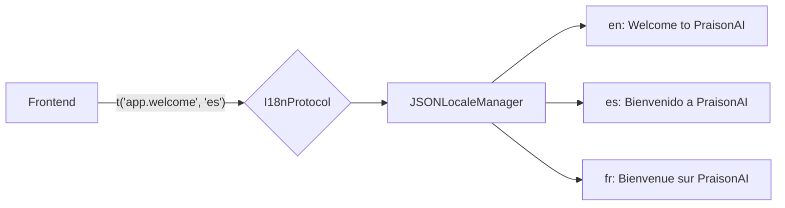

# Internationalization (i18n)

Multi-language support with **locale switching**, string lookup, and variable interpolation. Ships with English, Spanish, and French.

## Quick Start

```bash
# List available locales
curl http://localhost:8083/api/i18n/locales

# Get strings for a locale
curl http://localhost:8083/api/i18n/strings/es

# Translate a key
curl -X POST http://localhost:8083/api/i18n/translate \
  -H "Content-Type: application/json" \
  -d '{"key":"app.welcome","locale":"fr"}'
```

## How It Works



The i18n system uses a **key-based** translation approach:

1. Each string has a dotted key (e.g., `app.welcome`, `chat.send`)
2. Keys are organized by namespace: `app`, `chat`, `nav`, `error`
3. Variable interpolation: `{name}` placeholders are replaced at lookup time
4. Unknown keys return the key itself as fallback

## Built-in Locales

| Locale | Language | Strings |
|--------|----------|---------|
| `en` | English | 11 |
| `es` | Spanish (Español) | 11 |
| `fr` | French (Français) | 11 |

## Configuration

```python
from praisonaiui.features.i18n import JSONLocaleManager, set_i18n_manager

mgr = JSONLocaleManager(default_locale="es")
set_i18n_manager(mgr)

# Translate
mgr.t("app.welcome")          # "Bienvenido a PraisonAI"
mgr.t("app.welcome", "fr")    # "Bienvenue sur PraisonAI"
```

## REST API

| Endpoint | Method | Description |
|----------|--------|-------------|
| `/api/i18n/locales` | GET | List available locales |
| `/api/i18n/strings/{locale}` | GET | Get all strings for a locale |
| `/api/i18n/translate` | POST | Translate a key with optional variables |
| `/api/i18n/locale` | GET | Get current default locale |
| `/api/i18n/locale` | POST | Set default locale |

### GET /api/i18n/strings/es

```json
{
    "locale": "es",
    "strings": {
        "app.title": "PraisonAI",
        "app.welcome": "Bienvenido a PraisonAI",
        "chat.placeholder": "Escribe tu mensaje...",
        "chat.send": "Enviar",
        "chat.thinking": "Pensando...",
        "nav.dashboard": "Panel",
        "nav.agents": "Agentes",
        "nav.settings": "Configuración",
        "nav.sessions": "Sesiones",
        "error.generic": "Algo salió mal",
        "error.network": "Error de red"
    },
    "count": 11
}
```

### POST /api/i18n/translate

```json
// Request
{"key": "app.welcome", "locale": "fr"}

// Response
{"key": "app.welcome", "text": "Bienvenue sur PraisonAI"}
```
