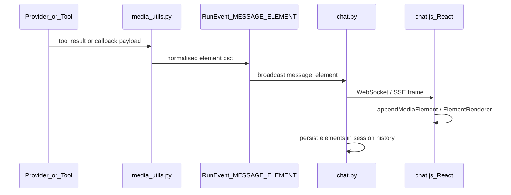

# Image Preview in Chat

Protocol-driven inline media for agent-generated images (and other element types) during chat streaming. Any backend that implements `BaseProvider` can emit images without PraisonAI-specific code in chat or the frontend.

## Problem This Solves

Before this feature, PraisonAIUI could **render** images (`Message.add_image`, `ElementRenderer`) but the **wire protocol dropped media** during agent runs. ImageAgent / tool results appeared as JSON in the tool-call panel instead of inline `` previews.

## Architecture

Modular layers — same pattern as [A2UI surfaces](./agent-ui-host.md):



### Layer responsibilities

| Layer | Module | Backend-agnostic? |
|-------|--------|-------------------|
| **Detection** | [`media_utils.py`](../../src/praisonaiui/media_utils.py) | Yes — normalises OpenAI, URL, b64, element dicts |
| **Protocol** | [`provider.py`](../../src/praisonaiui/provider.py) — `RunEventType.MESSAGE_ELEMENT` | Yes |
| **Adapter** | [`providers/__init__.py`](../../src/praisonaiui/providers/__init__.py) — PraisonAI bridge only | No — maps SDK/callback queue → protocol |
| **Transport** | [`chat.py`](../../src/praisonaiui/features/chat.py) — broadcast + persist | Yes |
| **Storage** | [`attachments.py`](../../src/praisonaiui/features/attachments.py) — `GET /api/chat/media/{id}` | Yes — reuses attachment store for b64 |
| **UI** | [`chat.js`](../../src/praisonaiui/templates/frontend/plugins/views/chat.js), [`ElementRenderer`](../../src/frontend/src/chat/MultimediaElements.tsx) | Yes — renders `{type, url, alt}` |

Detection and UI do **not** import PraisonAI. Only the provider adapter knows ImageAgent / OpenAI `{data: [{url}]}` shapes.

## Wire protocol

### Event type

```
type: "message_element"
element: { "type": "image", "url": "...", "alt": "..." }
session_id: "..."
run_id: "..."
```

Defined in Python as `RunEventType.MESSAGE_ELEMENT` and mirrored in [`types.ts`](../../src/frontend/src/types.ts).

### Helper (any provider)

```python
from praisonaiui.provider import BaseProvider, RunEvent, RunEventType

yield BaseProvider.message_element_event({
    "type": "image",
    "url": "https://example.com/out.png",
    "alt": "Generated image",
})
```

Element shape reuses the existing [message element schema](./message-elements.md) (`image`, `pdf`, `video`, `audio`, `file`, `code`).

## Data flow paths

### 1. Custom provider (swappable backend)

```python
import praisonaiui as aiui
from praisonaiui.provider import BaseProvider, RunEvent, RunEventType

class MyImageProvider(BaseProvider):
    async def run(self, message, *, session_id=None, agent_name=None, **kw):
        yield RunEvent(type=RunEventType.RUN_STARTED)
        # Call any image API here (OpenAI, Stability, local, etc.)
        yield BaseProvider.message_element_event({
            "type": "image",
            "url": image_url,
            "alt": "Generated image",
        })
        yield RunEvent(type=RunEventType.RUN_COMPLETED, content="Here is your image.")

aiui.set_provider(MyImageProvider())
```

Example app: [`examples/python/30-image-preview/app.py`](../../examples/python/30-image-preview/app.py).

### 2. Callback handler (`@aiui.reply`)

```python
import praisonaiui as aiui
from praisonaiui import Message

@aiui.reply
async def on_message(msg):
    m = Message(content="Here is your image:")
    m.add_image("https://example.com/chart.png", alt="Chart")
    await m.send()
```

`PraisonAIProvider` maps queue events (`image`, `message` + `elements`) → `MESSAGE_ELEMENT`.

### 3. Tool results (automatic detection)

When a tool completes, `tool_completed_extra()` in [`a2ui_utils.py`](../../src/praisonaiui/a2ui_utils.py) calls `build_media_extra()` from `media_utils`. Supported shapes:

| Input shape | Example |
|-------------|---------|
| OpenAI / ImageAgent | `{"data": [{"url": "...", "b64_json": "...", "revised_prompt": "..."}]}` |
| Explicit element | `{"type": "image", "url": "..."}` |
| Plain URL string | `"https://cdn.example.com/out.png"` |
| Data URL | `"data:image/png;base64,..."` |
| Nested elements | `{"elements": [{"type": "video", "url": "..."}]}` |

`chat.py` broadcasts `message_element` for each detected element and attaches `elements` to the persisted assistant message.

### 4. ImageAgent direct mode

If the registered agent's `chat()` returns an OpenAI-shaped dict, `PraisonAIProvider._run_direct_mode` runs `extract_media_elements()` and emits `MESSAGE_ELEMENT` events before `RUN_COMPLETED`.

## Base64 storage

Large `b64_json` payloads are **not** stored inline in message history. They are decoded and saved via `AttachmentManager`, then served at:

```
GET /api/chat/media/{attachment_id}
```

If storage fails, the system falls back to a `data:image/png;base64,...` URL.

## Frontend rendering

| Surface | Handler |
|---------|---------|
| Dashboard chat (template) | `chat.js` — `case 'message_element': appendMediaElement()` |
| React chat | `streamingStore.ts` — `pendingElements` + `ElementRenderer` |
| Tool call panel | Thumbnail from `toolCall.elements` when expanded |
| Session reload | `elements` on messages from `/api/chat/history` and `/sessions/{id}/runs` |

See also [Message Elements](./message-elements.md) for element properties and display modes.

## Deduplication

`_collect_element()` in `chat.py` dedupes by URL so the same image is not stored twice when both a `MESSAGE_ELEMENT` event and a tool completion carry the same URL.

## Out of scope

- **REST image generation** (`POST /v1/images/generations`) — separate OpenAI-compat endpoint; not wired into chat streaming
- **Canvas / A2UI surfaces** — separate feature for agent-driven UI catalogs
- **Auto-registering ImageAgent** — agents are configured explicitly by the user

## Tests

```bash
pytest tests/unit/test_media_utils.py \
       tests/integration/test_chat_image_preview.py -v -o addopts=
```

Coverage includes: detection normalisation, b64 fallback, provider callback bridge, `_run_and_broadcast` persistence, media serve route, ImageAgent dict responses, URL dedup.

## Related docs

- [Providers](../concepts/providers.md) — provider protocol and inline media snippet
- [Message Elements](./message-elements.md) — element types and Python API
- [Attachments](./attachments.md) — user file uploads (separate from generated media serve path)
- [Gateway Chat](./gateway-chat.md) — WebSocket event flow
