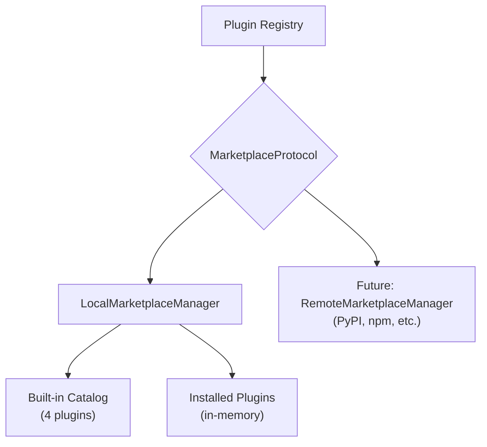

# Plugin Marketplace

Browse, search, install, and manage **plugins** from a registry. Supports local plugin discovery with a swappable backend for remote registries.

## Quick Start

```bash
# List available plugins
curl http://localhost:8083/api/marketplace/plugins

# Search for plugins
curl -X POST http://localhost:8083/api/marketplace/search \
  -H "Content-Type: application/json" \
  -d '{"query":"search"}'

# Install a plugin
curl -X POST http://localhost:8083/api/marketplace/install \
  -H "Content-Type: application/json" \
  -d '{"plugin_id":"web_search"}'
```

## How It Works



The marketplace uses a **protocol-driven** architecture. The default `LocalMarketplaceManager` ships with a built-in catalog of common plugins. Custom implementations can connect to remote registries.

## Built-in Plugins

| Plugin | Category | Description |
|--------|----------|-------------|
| `web_search` | tools | Search the web using DuckDuckGo |
| `code_executor` | tools | Execute Python code in sandbox |
| `file_manager` | tools | Read, write, and manage files |
| `memory_plugin` | memory | Persistent agent memory with ChromaDB |

## REST API

| Endpoint | Method | Description |
|----------|--------|-------------|
| `/api/marketplace/plugins` | GET | List all plugins |
| `/api/marketplace/search` | POST | Search plugins by query |
| `/api/marketplace/install` | POST | Install a plugin |
| `/api/marketplace/uninstall` | POST | Uninstall a plugin |
| `/api/marketplace/plugins/{id}` | GET | Get plugin details |

### POST /api/marketplace/install

```json
// Request
{"plugin_id": "web_search"}

// Response
{"status": "installed", "plugin": "web_search"}
```

### POST /api/marketplace/search

```json
// Request
{"query": "search", "limit": 20}

// Response
{"results": [{"id": "web_search", "name": "Web Search", "category": "tools", ...}], "count": 1}
```

## Related

- [Skills](../api/features-api.md#skills) — Tool catalog that marketplace plugins extend
