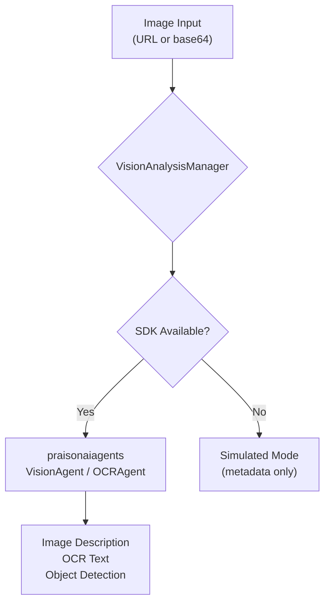

# Media Analysis

**Image understanding, OCR, and object detection** powered by VisionAgent — analyze uploaded images and documents.

## Quick Start

```bash
# List analysis capabilities
curl http://localhost:8083/api/media/capabilities

# Analyze an image
curl -X POST http://localhost:8083/api/media/analyze \
  -H "Content-Type: application/json" \
  -d '{"url":"https://example.com/photo.jpg","prompt":"What is in this image?"}'

# Extract text (OCR)
curl -X POST http://localhost:8083/api/media/ocr \
  -H "Content-Type: application/json" \
  -d '{"url":"https://example.com/document.png"}'
```

## How It Works



The media analysis feature uses the **VisionAgent** and **OCRAgent** from the PraisonAI SDK when available. Without the SDK, it returns simulated responses to allow frontend development without API keys.

### Capabilities

| Capability | Description |
|------------|-------------|
| `image_description` | Natural language description of image contents |
| `ocr` | Extract text from images and documents |
| `object_detection` | Identify objects in images |
| `image_qa` | Answer questions about image contents |

## Configuration

```python
from praisonaiui.features.media_analysis import VisionAnalysisManager, set_analysis_manager

# Default: auto-detects SDK availability
set_analysis_manager(VisionAnalysisManager())
```

## REST API

| Endpoint | Method | Description |
|----------|--------|-------------|
| `/api/media/analyze` | POST | Analyze an image |
| `/api/media/ocr` | POST | Extract text via OCR |
| `/api/media/capabilities` | GET | List analysis capabilities |

### POST /api/media/analyze

```json
// Request
{"url": "https://example.com/photo.jpg", "prompt": "What is in this image?"}
// or
{"base64_data": "iVBORw0KGgo...", "mime_type": "image/png"}

// Response (SDK available)
{"analysis": "The image shows a sunset over mountains...", "status": "success", "provider": "sdk"}

// Response (simulated)
{"analysis": "[Simulated] Image analysis for: https://example.com/photo.jpg",
 "status": "simulated", "provider": "fallback",
 "note": "Install praisonaiagents for real analysis"}

// Response (no image → 400)
{"error": "No image provided", "status": "error"}
```

### POST /api/media/ocr

```json
// Request
{"url": "https://example.com/document.png"}

// Response
{"text": "Extracted text from the document...", "status": "success", "provider": "sdk"}
```

## Related

- [Attachments](attachments.md) — Upload images to analyze via media analysis
