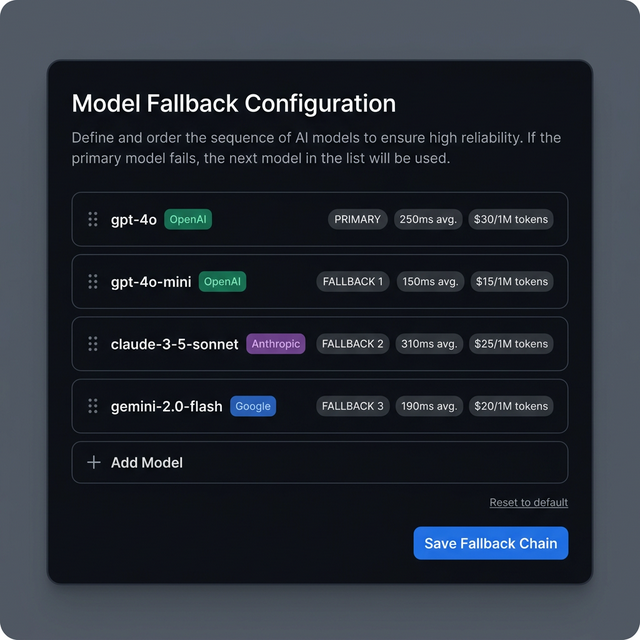
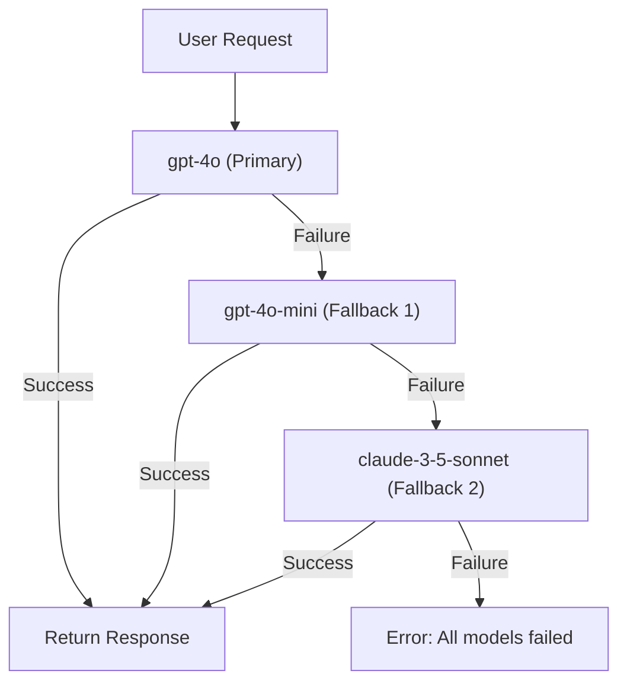

# Model Fallback

Configure **model fallback chains** for high availability — if the primary LLM fails, automatically try the next model in the chain.



## Quick Start

```bash
# List available models
curl http://localhost:8083/api/models

# Set a fallback chain
curl -X PUT http://localhost:8083/api/models/fallback \
  -H "Content-Type: application/json" \
  -d '{"models": ["gpt-4o", "gpt-4o-mini", "claude-3-5-sonnet"]}'
```

## How It Works



When a request is sent:

1. Try the **primary model** first
2. If it fails (rate limit, timeout, error), try **fallback 1**
3. Continue down the chain until a model responds
4. If all models fail, return an error

## Model Discovery

The `ModelFallbackManager` tries to discover models automatically:

1. **LiteLLM** — If installed, reads `litellm.model_list` for configured models
2. **Static catalog** — Falls back to common models (gpt-4o, gpt-4o-mini, claude-3-5-sonnet, gemini-2.0-flash)

## Configuration

```python
from praisonaiui.features.model_fallback import ModelFallbackManager

mgr = ModelFallbackManager()

# Get available models
models = mgr.get_models()
# [{"id": "gpt-4o", "provider": "openai"}, ...]

# Set fallback chain
mgr.set_fallback_chain(["gpt-4o", "gpt-4o-mini"])

# Get current chain
chain = mgr.get_fallback_chain()
# ["gpt-4o", "gpt-4o-mini"]
```

## REST API

| Endpoint | Method | Description |
|----------|--------|-------------|
| `/api/models` | GET | List available models + current fallback chain |
| `/api/models/fallback` | PUT | Set the fallback chain |

### List Models

```bash
curl http://localhost:8083/api/models
```

```json
{
  "models": [
    {"id": "gpt-4o", "provider": "openai"},
    {"id": "gpt-4o-mini", "provider": "openai"},
    {"id": "claude-3-5-sonnet", "provider": "anthropic"},
    {"id": "gemini-2.0-flash", "provider": "google"}
  ],
  "fallback_chain": ["gpt-4o", "gpt-4o-mini"]
}
```

## Related

- [Gateway Chat](gateway-chat.md) — Chat uses models via fallback chain
- [Providers](../concepts/providers.md) — LLM provider configuration
