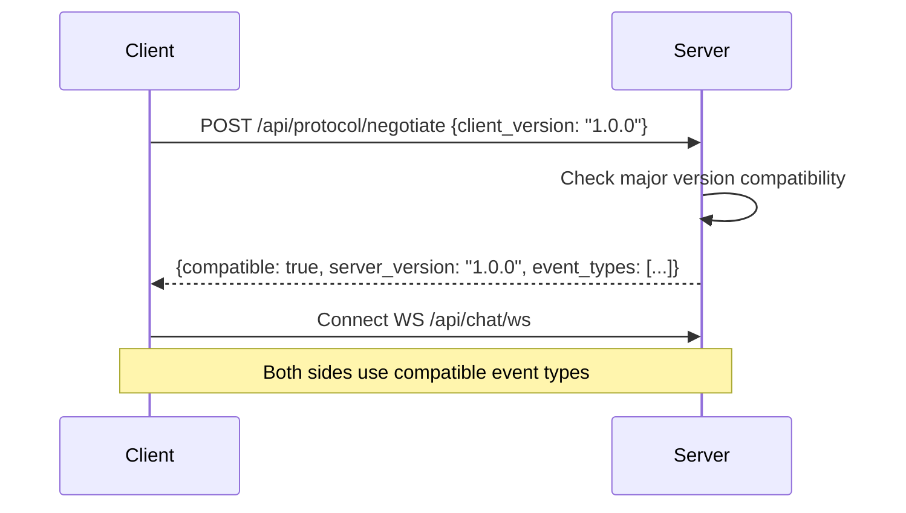

# Protocol Versioning

**WebSocket protocol negotiation** between client and server — ensures compatibility and graceful degradation.

## Quick Start

```bash
# Get protocol info
curl http://localhost:8083/api/protocol

# Negotiate version
curl -X POST http://localhost:8083/api/protocol/negotiate \
  -H "Content-Type: application/json" \
  -d '{"client_version": "1.0.0"}'
```

## How It Works



## Version Compatibility

The protocol uses **semantic versioning** — clients and servers are compatible if they share the **same major version**:

| Client Version | Server Version | Compatible? |
|---------------|----------------|-------------|
| 1.0.0 | 1.0.0 | ✅ Yes |
| 1.2.0 | 1.0.0 | ✅ Yes (same major) |
| 2.0.0 | 1.0.0 | ❌ No (different major) |

## Event Types

The protocol defines these standard event types:

| Event Type | Direction | Description |
|-----------|-----------|-------------|
| `chat` | Client → Server | User sends a message |
| `chat_abort` | Client → Server | Abort an active run |
| `ping` / `pong` | Both | Keepalive |
| `run_content` | Server → Client | Delta token (streaming) |
| `run_completed` | Server → Client | Run finished |
| `run_error` | Server → Client | Run failed |
| `tool_call_started` | Server → Client | Tool execution began |
| `tool_call_completed` | Server → Client | Tool returned result |
| `reasoning` | Server → Client | Agent reasoning/thinking |

## REST API

| Endpoint | Method | Description |
|----------|--------|-------------|
| `/api/protocol` | GET | Get protocol version and supported event types |
| `/api/protocol/negotiate` | POST | Check client compatibility |

### Protocol Info

```bash
curl http://localhost:8083/api/protocol
```

```json
{
  "version": "1.0.0",
  "event_types": ["chat", "run_content", "run_completed", "tool_call_started", ...],
  "features": {
    "streaming": true,
    "tool_calls": true,
    "reasoning": true,
    "abort": true
  }
}
```

### Negotiate

```bash
curl -X POST http://localhost:8083/api/protocol/negotiate \
  -H "Content-Type: application/json" \
  -d '{"client_version": "1.0.0"}'
```

```json
{
  "compatible": true,
  "server_version": "1.0.0",
  "client_version": "1.0.0"
}
```

## Related

- [Gateway Chat](gateway-chat.md) — Uses the protocol for WebSocket streaming
- [Protocols](protocols.md) — Feature protocol architecture
