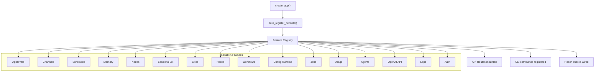

# Feature Protocols

PraisonAIUI uses a **protocol-driven architecture** to wire features into the server. Every feature module implements the `BaseFeatureProtocol` ABC, which auto-registers API routes, CLI commands, and health checks.

## Architecture



## Quick Start

### List All Features

```bash
# CLI
aiui features list --server http://127.0.0.1:8000

# API
curl http://127.0.0.1:8000/api/features
```

### Python — Create a Custom Feature

```python
from praisonaiui.features._base import BaseFeatureProtocol
from starlette.routing import Route
from starlette.requests import Request
from starlette.responses import JSONResponse

class MyFeature(BaseFeatureProtocol):
    feature_name = "my_feature"
    feature_description = "Does something cool"

    @property
    def name(self) -> str:
        return self.feature_name

    @property
    def description(self) -> str:
        return self.feature_description

    def routes(self):
        return [Route("/api/my-feature", self._handler, methods=["GET"])]

    async def _handler(self, request: Request) -> JSONResponse:
        return JSONResponse({"hello": "world"})

# Register it
from praisonaiui.features import register_feature
register_feature(MyFeature())
```

## BaseFeatureProtocol API

Every feature module must implement:

| Method | Return | Required | Description |
|--------|--------|----------|-------------|
| `name` | `str` | ✓ | Unique feature identifier |
| `description` | `str` | ✓ | Human-readable description |
| `routes()` | `List[Route]` | ✓ | Starlette routes to mount |
| `cli_commands()` | `List[dict]` | ○ | CLI command metadata |
| `health()` | `dict` | ○ | Health check (default: `{"status": "ok"}`) |
| `info()` | `dict` | ○ | Metadata for `/api/features` listing |

### `cli_commands()` Format

```python
def cli_commands(self):
    return [{
        "name": "my-feature",        # Typer subcommand group name
        "help": "My feature things",  # Group help text
        "commands": {
            "list": {"help": "List items", "handler": self._cli_list},
            "add":  {"help": "Add item",  "handler": self._cli_add},
        },
    }]
```

## Registry Functions

```python
from praisonaiui.features import (
    register_feature,        # Register a feature instance
    get_features,            # Get all registered features (dict)
    get_feature,             # Get a single feature by name
    auto_register_defaults,  # Register all 10 built-in features
)
```

## Built-in Features Reference

### 1. Approvals

Tool-execution approval management with policies, history, and SSE streaming.

| Endpoint | Method | Description |
|----------|--------|-------------|
| `/api/approvals` | GET | List all approvals |
| `/api/approvals` | POST | Create approval request |
| `/api/approvals/pending` | GET | List pending approvals |
| `/api/approvals/history` | GET | List resolved approvals |
| `/api/approvals/policies` | GET | Get auto-approve/deny policies |
| `/api/approvals/policies` | PUT | Update policies |
| `/api/approvals/stream` | GET | SSE stream for real-time updates |
| `/api/approvals/{id}` | GET | Get single approval |
| `/api/approvals/{id}/approve` | POST | Approve request |
| `/api/approvals/{id}/deny` | POST | Deny request |

**CLI:** `aiui approval list`, `aiui approval pending`

### 2. Channels

Multi-platform messaging channel management (Discord, Slack, Telegram, WhatsApp, etc.).

| Endpoint | Method | Description |
|----------|--------|-------------|
| `/api/channels` | GET | List all channels (enriched with gateway status) |
| `/api/channels` | POST | Add a channel |
| `/api/channels/platforms` | GET | List supported platforms |
| `/api/channels/{id}` | GET | Get channel details |
| `/api/channels/{id}` | PUT | Update channel |
| `/api/channels/{id}` | DELETE | Remove channel |
| `/api/channels/{id}/toggle` | POST | Enable/disable |
| `/api/channels/{id}/status` | GET | Live status (gateway-enriched) |
| `/api/channels/{id}/restart` | POST | Restart channel bot (via gateway) |

**CLI:** `aiui channel list`, `aiui channel status`, `aiui channel platforms`

### 3. Schedules

Manage scheduled jobs (cron, interval, one-shot).

| Endpoint | Method | Description |
|----------|--------|-------------|
| `/api/schedules` | GET | List all jobs |
| `/api/schedules` | POST | Add a job |
| `/api/schedules/{id}` | GET | Get job details |
| `/api/schedules/{id}` | PUT | Update schedule config |
| `/api/schedules/{id}` | DELETE | Remove job |
| `/api/schedules/{id}/toggle` | POST | Enable/disable |
| `/api/schedules/{id}/run` | POST | Trigger immediately |
| `/api/schedules/{id}/stop` | POST | Stop running schedule |
| `/api/schedules/{id}/stats` | GET | Get execution statistics |

**CLI:** `aiui schedule list`, `aiui schedule add <name> <msg>`, `aiui schedule remove <id>`, `aiui schedule status`

### 4. Memory

Agent memory management (short-term, long-term, entity).

| Endpoint | Method | Description |
|----------|--------|-------------|
| `/api/memory` | GET | List memories (filter: `?type=short\|long\|entity\|all`) |
| `/api/memory` | POST | Add memory entry |
| `/api/memory/search` | POST | Search memories |
| `/api/memory/{id}` | GET | Get single memory |
| `/api/memory/{id}` | DELETE | Delete memory |
| `/api/memory` | DELETE | Clear memories (filter: `?type=all`) |

**CLI:** `aiui memory list`, `aiui memory add <text>`, `aiui memory search <query>`, `aiui memory clear`, `aiui memory status`

### 5. Nodes

Execution node registration, agent bindings, and instance presence.

| Endpoint | Method | Description |
|----------|--------|-------------|
| `/api/nodes` | GET | List all nodes |
| `/api/nodes` | POST | Register a node |
| `/api/nodes/{id}` | GET | Get node details |
| `/api/nodes/{id}` | PUT | Update node |
| `/api/nodes/{id}` | DELETE | Remove node |
| `/api/nodes/{id}/status` | GET | Node status (gateway-enriched) |
| `/api/nodes/{id}/agents` | GET/PUT | Get/set agent bindings |
| `/api/instances` | GET | List connected instances |
| `/api/instances/heartbeat` | POST | Record presence heartbeat |

**CLI:** `aiui node list`, `aiui node status`, `aiui node instances`

### 6. Extended Sessions

Advanced session management (state, context, labels, usage).

| Endpoint | Method | Description |
|----------|--------|-------------|
| `/api/sessions/{id}/state` | GET | Get session state |
| `/api/sessions/{id}/state` | POST | Save session state |
| `/api/sessions/{id}/context` | POST | Build context |
| `/api/sessions/{id}/compact` | POST | Compact session (with stats) |
| `/api/sessions/{id}/reset` | POST | Reset session |
| `/api/sessions/{id}/preview` | GET | Formatted preview |
| `/api/sessions/{id}/labels` | GET/POST | Get/set labels |
| `/api/sessions/{id}/usage` | GET | Get usage stats |

### 7. Skills

Agent skill registration and discovery.

| Endpoint | Method | Description |
|----------|--------|-------------|
| `/api/skills` | GET | List all tools (filter: `?category=`, `?enabled=`, `?search=`) |
| `/api/skills` | POST | Register custom skill |
| `/api/skills/categories` | GET | List tool categories |
| `/api/skills/{id}` | GET | Get tool details |
| `/api/skills/{id}` | PUT | Update custom skill |
| `/api/skills/{id}` | DELETE | Remove custom skill |
| `/api/skills/{id}/toggle` | POST | Toggle enabled/disabled |
| `/api/skills/{id}/config` | PUT | Set tool configuration/API keys |

**CLI:** `aiui skills list`, `aiui skills status`

### 8. Hooks

Pre/post operation hooks for tool calls, agent runs, etc.

| Endpoint | Method | Description |
|----------|--------|-------------|
| `/api/hooks` | GET | List hooks |
| `/api/hooks` | POST | Register hook |
| `/api/hooks/log` | GET | View execution log |
| `/api/hooks/{id}` | GET | Get hook details |
| `/api/hooks/{id}` | DELETE | Remove hook |
| `/api/hooks/{id}/trigger` | POST | Trigger manually |

**CLI:** `aiui hooks list`, `aiui hooks trigger <id>`, `aiui hooks log`

### 9. Workflows

Multi-step workflow orchestration (Pipeline, Route, Parallel, Loop).

| Endpoint | Method | Description |
|----------|--------|-------------|
| `/api/workflows` | GET | List workflows |
| `/api/workflows` | POST | Create workflow |
| `/api/workflows/runs` | GET | List all runs |
| `/api/workflows/runs/{id}` | GET | Get run details |
| `/api/workflows/{id}` | GET | Get workflow |
| `/api/workflows/{id}` | DELETE | Delete workflow |
| `/api/workflows/{id}/run` | POST | Execute workflow |
| `/api/workflows/{id}/status` | GET | Workflow status |

**CLI:** `aiui workflows list`, `aiui workflows run <id>`, `aiui workflows status`, `aiui workflows runs`

### 10. Config Runtime

Live runtime configuration without server restart.

| Endpoint | Method | Description |
|----------|--------|-------------|
| `/api/config/runtime` | GET | Get all config |
| `/api/config/runtime` | PATCH | Merge config values |
| `/api/config/runtime` | PUT | Replace all config |
| `/api/config/runtime/history` | GET | Change history |
| `/api/config/runtime/{key}` | GET | Get single key |
| `/api/config/runtime/{key}` | PUT | Set single key |
| `/api/config/runtime/{key}` | DELETE | Delete key |
| `/api/config/schema` | GET | JSON Schema for form rendering |
| `/api/config/validate` | POST | Validate config without applying |
| `/api/config/apply` | POST | Validate and apply config |
| `/api/config/defaults` | GET | Get default values from schema |

**CLI:** `aiui config get [key]`, `aiui config set <key> <value>`, `aiui config list`, `aiui config history`

### 11. Jobs

Async job submission and monitoring with real-time SSE streaming.

| Endpoint | Method | Description |
|----------|--------|-------------|
| `/api/jobs` | GET | List jobs (filter: `?status=`, `?limit=`, `?offset=`) |
| `/api/jobs` | POST | Submit job (returns 202) |
| `/api/jobs/stats` | GET | Executor statistics |
| `/api/jobs/{id}` | GET | Get job details |
| `/api/jobs/{id}` | DELETE | Delete completed job |
| `/api/jobs/{id}/status` | GET | Get status + progress |
| `/api/jobs/{id}/result` | GET | Get result (409 if not complete) |
| `/api/jobs/{id}/cancel` | POST | Cancel running job |
| `/api/jobs/{id}/stream` | GET | SSE stream (status/progress/result/error events) |

**CLI:** `aiui job list`, `aiui job status [id]`, `aiui job stats`

### 12. Usage

Usage analytics with per-model cost tracking, time-series data, and breakdowns.

| Endpoint | Method | Description |
|----------|--------|-------------|
| `/api/usage` | GET | Summary (totals, averages) |
| `/api/usage/details` | GET | Detailed usage records |
| `/api/usage/models` | GET | Per-model breakdown |
| `/api/usage/sessions` | GET | Per-session breakdown |
| `/api/usage/agents` | GET | Per-agent breakdown |
| `/api/usage/timeseries` | GET | Time-series data for charts |
| `/api/usage/costs` | GET | Cost table (21 models) |
| `/api/usage/track` | POST | Track usage event |

**CLI:** `aiui usage summary`, `aiui usage models`, `aiui usage cost`

### 13. Agents

Agent definition CRUD with model selection, execution via `praisonaiagents.Agent`.

| Endpoint | Method | Description |
|----------|--------|-------------|
| `/api/agents/definitions` | GET | List all agent definitions |
| `/api/agents/definitions` | POST | Create new agent |
| `/api/agents/definitions/{id}` | GET | Get agent details |
| `/api/agents/definitions/{id}` | PUT | Update agent |
| `/api/agents/definitions/{id}` | DELETE | Delete agent |
| `/api/agents/models` | GET | List available models (13 models) |
| `/api/agents/duplicate/{id}` | POST | Duplicate an agent |
| `/api/agents/run/{id}` | POST | Execute agent via `Agent.start()` |

**CLI:** `aiui agents list`, `aiui agents create`

### 14. OpenAI API

OpenAI-compatible `/v1/*` API routes wrapping `praisonai.capabilities`.

| Endpoint | Method | Description |
|----------|--------|-------------|
| `/v1` | GET | API info / endpoint list |
| `/v1/chat/completions` | POST | Chat completions |
| `/v1/completions` | POST | Legacy text completions |
| `/v1/embeddings` | POST | Create embeddings |
| `/v1/images/generations` | POST | Generate images |
| `/v1/audio/transcriptions` | POST | Transcribe audio |
| `/v1/audio/speech` | POST | Text to speech |
| `/v1/moderations` | POST | Content moderation |
| `/v1/models` | GET | List available models |
| `/v1/models/{id}` | GET | Get model info |
| `/v1/responses` | POST | OpenAI Responses API |
| `/v1/files` | GET/POST | File management |
| `/v1/files/{id}` | GET/DELETE | File operations |
| `/v1/assistants` | GET/POST | Assistants API |

### 15. Logs

Real-time log streaming via WebSocket with level filtering.

| Endpoint | Method | Description |
|----------|--------|-------------|
| `/api/logs/stream` | WS | WebSocket for real-time log streaming |
| `/api/logs/levels` | GET | Available log levels with colors |
| `/api/logs/stats` | GET | Log buffer statistics |
| `/api/logs/clear` | POST | Clear log buffer |

**CLI:** `aiui logs tail`, `aiui logs clear`

### 16. Auth

Multi-mode authentication (none, api_key, session, password).

| Endpoint | Method | Description |
|----------|--------|-------------|
| `/api/auth/status` | GET | Current auth status |
| `/api/auth/config` | GET | Get auth config |
| `/api/auth/config` | PUT | Set auth config |
| `/api/auth/keys` | GET | List API keys |
| `/api/auth/keys` | POST | Create API key |
| `/api/auth/keys/{id}` | DELETE | Revoke API key |
| `/api/auth/login` | POST | Login with password |
| `/api/auth/logout` | POST | Logout session |
| `/api/auth/sessions` | GET | List active sessions |
| `/api/auth/password` | POST | Set/change password |

## Route Ordering

> **Important:** When defining routes with parametric paths (e.g., `/{id}`), always place literal paths (e.g., `/log`, `/runs`) **before** the parametric route. Starlette matches routes in order, and a parametric route will capture literal segments as parameter values.

```python
# ✓ Correct — literal before parametric
Route("/api/hooks/log", self._log, methods=["GET"]),
Route("/api/hooks/{hook_id}", self._get, methods=["GET"]),

# ✗ Wrong — "log" captured as hook_id
Route("/api/hooks/{hook_id}", self._get, methods=["GET"]),
Route("/api/hooks/log", self._log, methods=["GET"]),
```

## Integration Example

```python
"""Custom analytics feature — tracks page views."""
from praisonaiui.features._base import BaseFeatureProtocol
from starlette.routing import Route
from starlette.requests import Request
from starlette.responses import JSONResponse

_views = {}

class AnalyticsFeature(BaseFeatureProtocol):
    feature_name = "analytics"
    feature_description = "Page view tracking"

    @property
    def name(self): return self.feature_name

    @property
    def description(self): return self.feature_description

    def routes(self):
        return [
            Route("/api/analytics", self._list, methods=["GET"]),
            Route("/api/analytics/track", self._track, methods=["POST"]),
        ]

    async def _list(self, request):
        return JSONResponse({"views": _views, "total": sum(_views.values())})

    async def _track(self, request):
        body = await request.json()
        page = body.get("page", "/")
        _views[page] = _views.get(page, 0) + 1
        return JSONResponse({"page": page, "count": _views[page]})

    def cli_commands(self):
        return [{"name": "analytics", "help": "View analytics",
                 "commands": {"stats": {"help": "Show stats", "handler": self._cli_stats}}}]

    def _cli_stats(self):
        return f"Total views: {sum(_views.values())}"

# Register on import
from praisonaiui.features import register_feature
register_feature(AnalyticsFeature())
```
