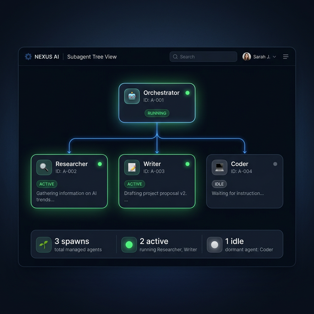
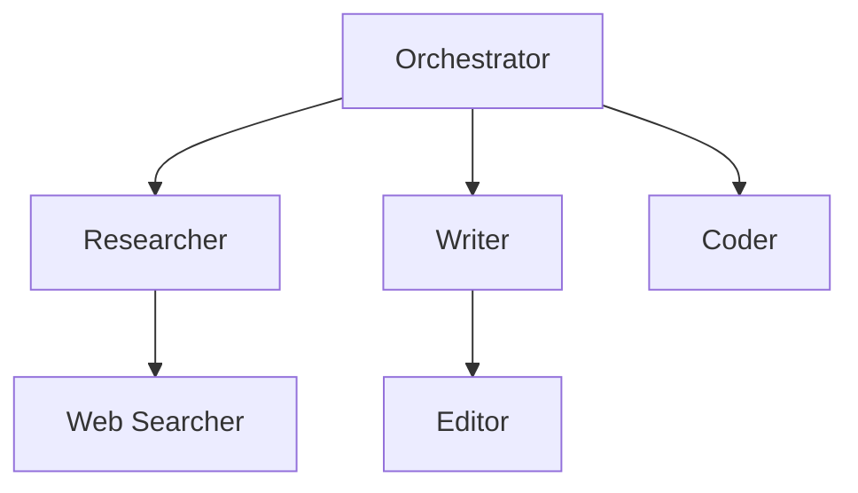

# Subagent Tree View

Visualize **agent hierarchies** — see which agents spawn subagents, track their status, and monitor the full execution tree.



## Quick Start

```bash
# Get the subagent tree for a session
curl http://localhost:8083/api/subagents/my-session

# List all spawns across sessions
curl http://localhost:8083/api/subagents
```

## How It Works



When agents spawn subagents during execution, each spawn is registered with the `SubagentManager`:

1. **Parent agent** spawns a **child agent**
2. The spawn is recorded with session ID, timestamp, and status
3. A tree structure is built from spawn records
4. The tree can be queried per-session via the REST API

## Configuration

```python
from praisonaiui.features.subagents import SubagentManager

mgr = SubagentManager()

# Register a spawn event
spawn_id = mgr.register_spawn(
    parent_agent="orchestrator",
    child_agent="researcher",
    session_id="my-session",
)

# Get the tree
tree = mgr.get_tree("my-session")
# {
#   "session_id": "my-session",
#   "roots": [{"name": "orchestrator", "children": [{"name": "researcher", ...}]}],
#   "total_spawns": 1
# }
```

## REST API

| Endpoint | Method | Description |
|----------|--------|-------------|
| `/api/subagents` | GET | List all spawn events |
| `/api/subagents/{session_id}` | GET | Get tree for a session |

### Get Tree

```bash
curl http://localhost:8083/api/subagents/my-session
```

```json
{
  "session_id": "my-session",
  "roots": [
    {
      "name": "orchestrator",
      "children": [
        {"name": "researcher", "children": []},
        {"name": "writer", "children": [
          {"name": "editor", "children": []}
        ]}
      ]
    }
  ],
  "total_spawns": 3
}
```

## Related

- [Gateway Chat](gateway-chat.md) — Chat triggers agent execution
- [Protocols](protocols.md) — Feature protocol system
