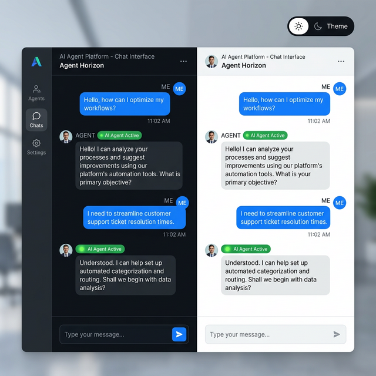
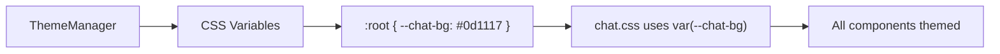

# Theme System

Switch between **dark**, **light**, and **custom themes** using CSS custom properties — applied across all dashboard pages including chat.



## Quick Start

```bash
# Get current theme
curl http://localhost:8083/api/theme

# Switch to light mode
curl -X PUT http://localhost:8083/api/theme \
  -H "Content-Type: application/json" \
  -d '{"theme": "light"}'
```

## Built-in Themes

### Dark (Default)

| Variable | Value | Usage |
|----------|-------|-------|
| `--chat-bg` | `#0d1117` | Background |
| `--chat-text` | `#e6edf3` | Primary text |
| `--chat-user-bg` | `#1f6feb` | User message bubble |
| `--chat-assistant-bg` | `#161b22` | Assistant message bubble |
| `--chat-input-bg` | `#0d1117` | Input area |
| `--chat-border` | `#30363d` | Borders |
| `--chat-accent` | `#58a6ff` | Links and accents |
| `--chat-code-bg` | `#161b22` | Code blocks |

### Light

| Variable | Value | Usage |
|----------|-------|-------|
| `--chat-bg` | `#ffffff` | Background |
| `--chat-text` | `#1f2328` | Primary text |
| `--chat-user-bg` | `#ddf4ff` | User message bubble |
| `--chat-assistant-bg` | `#f6f8fa` | Assistant message bubble |
| `--chat-input-bg` | `#ffffff` | Input area |
| `--chat-border` | `#d1d9e0` | Borders |
| `--chat-accent` | `#0969da` | Links and accents |
| `--chat-code-bg` | `#f6f8fa` | Code blocks |

## Custom Themes

Register a custom theme from Python:

```python
from praisonaiui.features.theme import ThemeManager

mgr = ThemeManager()
mgr.register_theme("ocean", {
    "--chat-bg": "#001122",
    "--chat-text": "#e0f0ff",
    "--chat-user-bg": "#004488",
    "--chat-assistant-bg": "#002244",
    "--chat-input-bg": "#001122",
    "--chat-border": "#003366",
    "--chat-accent": "#66bbff",
    "--chat-code-bg": "#002244",
})
```

Or via API:

```bash
curl -X POST http://localhost:8083/api/theme/custom \
  -H "Content-Type: application/json" \
  -d '{
    "name": "ocean",
    "variables": {
      "--chat-bg": "#001122",
      "--chat-text": "#e0f0ff"
    }
  }'
```

## REST API

| Endpoint | Method | Description |
|----------|--------|-------------|
| `/api/theme` | GET | Get current theme and CSS variables |
| `/api/theme` | PUT | Set the active theme |
| `/api/theme/list` | GET | List all available themes |
| `/api/theme/custom` | POST | Register a custom theme |

## How CSS Variables Work



The theme system injects CSS custom properties into the `:root` element. All chat and dashboard CSS uses `var(--chat-*)` references, so switching themes instantly updates the entire UI.

## Related

- [Gateway Chat](gateway-chat.md) — Chat interface (themed)
- [Theming](theming.md) — General theming concepts
- [Dark Mode](dark-mode.md) — Dark mode toggle
