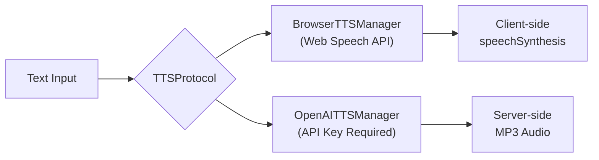

# Text-to-Speech (TTS)

Synthesize speech from text using **swappable backends** — browser-native (zero cost) or OpenAI TTS API.

## Quick Start

```bash
# List available voices
curl http://localhost:8083/api/tts/voices

# Synthesize speech
curl -X POST http://localhost:8083/api/tts/synthesize \
  -H "Content-Type: application/json" \
  -d '{"text":"Hello from PraisonAI","voice":"default"}'
```

## How It Works



**Default**: `BrowserTTSManager` — uses the browser's built-in Web Speech API, requires no API key, runs entirely client-side.

**Optional**: `OpenAITTSManager` — uses OpenAI's TTS API for higher-quality voices (alloy, echo, fable, onyx, nova, shimmer). Requires `openai` package and API key.

## Configuration

```python
from praisonaiui.features.tts import set_tts_manager, OpenAITTSManager

# Switch to OpenAI TTS (requires OPENAI_API_KEY)
set_tts_manager(OpenAITTSManager())
```

## REST API

| Endpoint | Method | Description |
|----------|--------|-------------|
| `/api/tts/voices` | GET | List available voices |
| `/api/tts/synthesize` | POST | Synthesize speech from text |

### GET /api/tts/voices

```json
{
    "voices": [
        {"id": "default", "name": "Default", "lang": "en-US"},
        {"id": "google-us", "name": "Google US English", "lang": "en-US"},
        {"id": "google-uk", "name": "Google UK English", "lang": "en-GB"}
    ],
    "count": 3
}
```

### POST /api/tts/synthesize

```json
// Request
{"text": "Hello from PraisonAI", "voice": "default"}

// Response (browser)
{
    "type": "browser_speech",
    "text": "Hello from PraisonAI",
    "voice": "default",
    "instruction": "Use window.speechSynthesis.speak(new SpeechSynthesisUtterance(text))"
}
```

## Related

- [Gateway Chat](gateway-chat.md) — Chat can use TTS for voice responses
