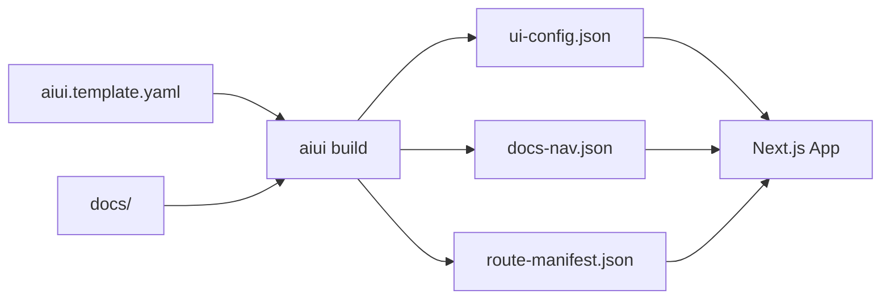

# PraisonAIUI

**One YAML file, one docs folder, one command — ship a beautiful documentation site.**

PraisonAIUI is a YAML-driven website generator that transforms a single configuration file and a docs folder into a modern, production-ready website.

## ✨ Features

<div class="grid cards" markdown>

- :material-file-document: **YAML-Driven**  
  Configure your entire site with a single YAML file

- :material-puzzle: **Component Slots**  
  Flexible slot system for headers, sidebars, and content

- :material-palette: **Theming**  
  Dark mode, custom colors, and UI framework support

- :material-rocket-launch: **Hot Reload**  
  Instant rebuilds during development

</div>

## Quick Start

=== "Python"

    ```bash
    pip install praisonaiui
    aiui init
    aiui build
    ```

=== "Node.js"

    ```bash
    npm install praisonaiui
    npx aiui init
    npx aiui build
    ```

## How It Works



## Example Configuration

```yaml
site:
  title: "My Docs"

content:
  docs:
    dir: "./docs"

templates:
  docs:
    layout: "ThreeColumnLayout"
    slots:
      main: { type: "DocContent" }

routes:
  - match: "/docs/**"
    template: "docs"
```

## Next Steps

- [Installation](getting-started/installation.md) - Get PraisonAIUI installed
- [Quick Start](getting-started/quickstart.md) - Create your first project
- [Configuration](concepts/configuration.md) - Learn the YAML schema
