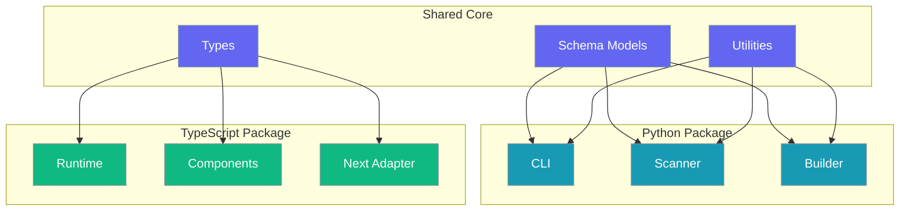
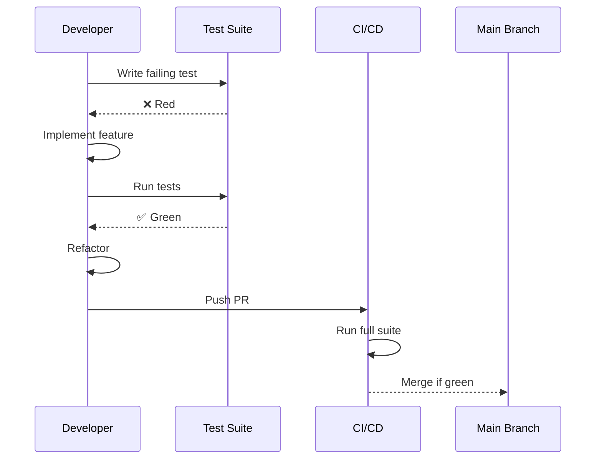
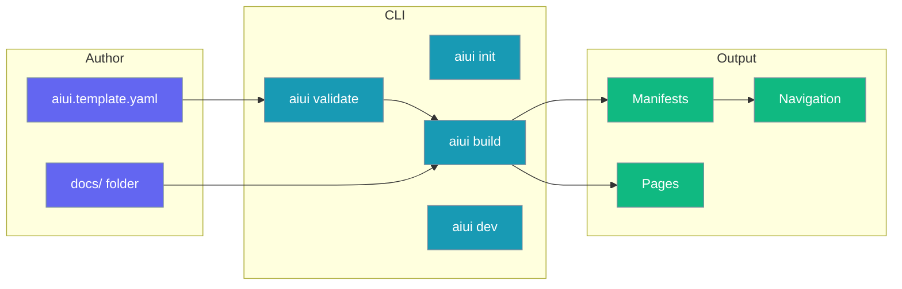
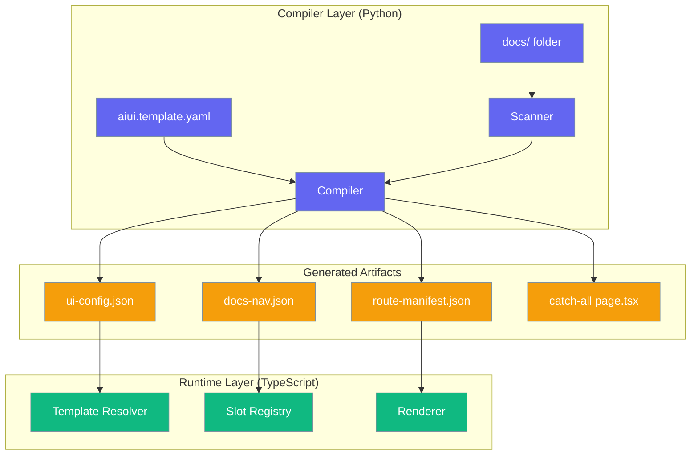
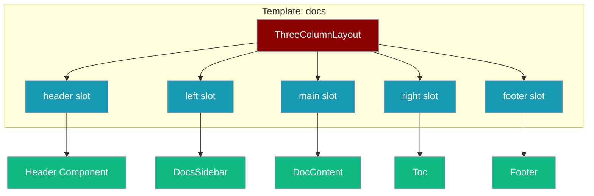
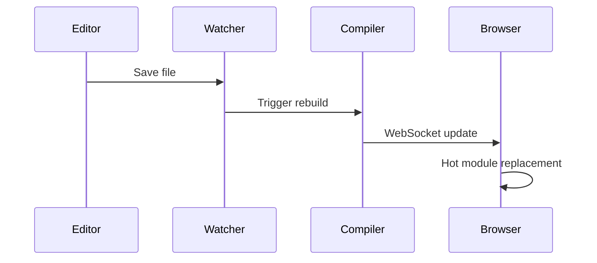

# PraisonAIUI - Comprehensive Product Requirements Document

## Executive Summary

**PraisonAIUI** is a YAML-driven website generator that transforms a single configuration file (`aiui.template.yaml`) and a `docs/` folder into a modern, production-ready website with automatic page generation, navigation, and layouts.

### Core Aim
> **One YAML file to build an entire website.**
>
> Users should be able to create, customize, and deploy a complete documentation site by editing a single `aiui.template.yaml` file. No JavaScript knowledge required. Change the theme, layout, colors, and components—all through YAML configuration.

### Vision
> "One YAML file, one docs folder, one command — ship a beautiful documentation site."

### Key Principles
1. **Zero-Code Customization** - Change themes, colors, layouts via YAML
2. **Instant Preview** - `aiui serve` shows live results
3. **Production Ready** - Built-in SEO, accessibility, i18n support
4. **Extensible** - Advanced users can scaffold full React projects with `aiui init --frontend`

### Distribution
- `pip install praisonaiui` → Python CLI for scan/validate/build/watch
- `npm install praisonaiui` → JS runtime + framework adapters + optional Node CLI

---

## Table of Contents

1. [Problem Statement](#1-problem-statement)
2. [Goals & Non-Goals](#2-goals--non-goals)
3. [Personas & User Stories](#3-personas--user-stories)
4. [Product Overview](#4-product-overview)
5. [Monorepo Structure](#5-monorepo-structure)
6. [Configuration Specification](#6-configuration-specification)
7. [JSON Schema](#7-json-schema)
8. [Output Architecture](#8-output-architecture)
9. [Component Architecture](#9-component-architecture)
10. [API Specifications](#10-api-specifications)
11. [CLI Reference](#11-cli-reference)
12. [Error Handling](#12-error-handling)
13. [Testing Strategy](#13-testing-strategy)
14. [CI/CD Pipeline](#14-cicd-pipeline)
15. [Performance Requirements](#15-performance-requirements)
16. [Accessibility](#16-accessibility)
17. [Internationalization](#17-internationalization)
18. [Plugin System](#18-plugin-system)
19. [Theming System](#19-theming-system)
20. [Security](#20-security)
21. [Versioning](#21-versioning)
22. [Developer Experience](#22-developer-experience)
23. [Roadmap](#23-roadmap)
24. [Acceptance Criteria](#24-acceptance-criteria)

---

## Core Engineering Principles

> **Philosophy**: Minimal changes with maximum impact. Every line of code must earn its place.

### The Three Pillars

| Pillar | Description | Enforcement |
|--------|-------------|-------------|
| **DRY** | Don't Repeat Yourself — reuse existing abstractions | Code review, shared utilities |
| **TDD** | Test-Driven Development — tests first, implementation second | CI blocks merge without tests |
| **Minimal Impact** | Smallest change that solves the problem | PR size limits, incremental delivery |

### DRY Architecture



**DRY Enforcement:**
- Schema models defined once in Python, exported as JSON Schema for TypeScript
- Shared type definitions via generated `.d.ts` files
- Common utilities (glob matching, path resolution) abstracted into shared modules
- Configuration validation logic reused across CLI and runtime

### TDD Workflow



**TDD Requirements:**
- Every feature must have tests written BEFORE implementation
- Tests must fail initially (proving they test the right thing)
- Coverage thresholds: 90% unit, 80% integration
- No PR merge without passing tests

### Minimal Changes Philosophy

| Principle | Application |
|-----------|-------------|
| **Incremental Delivery** | Ship smallest working increment |
| **Backward Compatible** | No breaking changes without deprecation |
| **Single Responsibility** | Each PR does one thing well |
| **Lazy Loading** | Import only what's needed, when needed |
| **Protocol-First** | Define interfaces before implementations |

**Impact Metrics:**
- Lines of code per feature: Target < 200 LOC
- Dependencies added: Target 0 new deps per feature
- Breaking changes: Target 0 per minor version
- Import time: Target < 500ms cold start

### Implementation Checklist

Before any feature implementation:

- [ ] **Tests exist** that will fail without the feature
- [ ] **No duplication** — checked existing code for reusable parts
- [ ] **Minimal scope** — smallest change that delivers value
- [ ] **Type-safe** — all interfaces have type definitions
- [ ] **Documented** — inline docs and README updated
- [ ] **Performance validated** — no import-time or runtime regression

---

## 1. Problem Statement

Building a docs+marketing website requires:
- Routing + navigation wiring
- Repeated layout boilerplate (header/footer/sidebar)
- Converting markdown to pages
- Keeping docs structure and site structure in sync

**Solution**: A single source of truth (`aiui.template.yaml`) that:
- Declares global components (header/footer/sidebar blocks)
- Declares reusable templates (layout + slots)
- Assigns templates to page sets (folders/globs like `/docs/**`)
- Points to a docs folder and auto-generates pages + nav

---

## 2. Goals & Non-Goals

### Goals (v1)
| ID | Goal | Success Metric |
|----|------|----------------|
| G1 | One YAML defines components, templates, routes, content | Zero boilerplate files |
| G2 | Docs-folder-first workflow | Auto pages from `docs/**.md(x)` |
| G3 | Modern output (Next.js App Router + Tailwind) | Lighthouse score > 90 |
| G4 | Dual packaging (pip + npm) | Install < 30 seconds |

### Non-Goals (v1)
- WYSIWYG editor
- Full CMS (auth, roles, DB)
- Multi-framework support beyond Next.js

---

## 3. Personas & User Stories

### Personas
| Persona | Description | Primary Need |
|---------|-------------|--------------|
| Indie Dev | Solo founder shipping fast | Docs + landing, minimal setup |
| SDK Maintainer | Open source library owner | Auto-updated docs from folder |
| Agency Team | Multiple client sites | Consistent reusable templates |

### User Stories
1. "I point to `docs/` and all pages appear under `/docs`."
2. "I define `docs` template once and apply it to `/docs/**`."
3. "I define `marketing` template and apply it to `/`, `/pricing`, `/blog/**`."
4. "I override one slot (e.g., hide right TOC) for a subtree or page."
5. "I run `aiui dev` and changes in docs/yaml hot-reload."

---

## 4. Product Overview

### Developer Workflow


---

## 5. Monorepo Structure

```
praisonaiui/
├── .github/
│   └── workflows/
│       └── ci.yml                 # Lint, test, build, deploy docs
│
├── src/
│   ├── praisonaiui/               # Python package (pip install praisonaiui)
│   │   ├── __init__.py
│   │   ├── __version__.py
│   │   ├── cli.py                 # Typer CLI (aiui command)
│   │   ├── schema/
│   │   │   ├── __init__.py
│   │   │   ├── models.py          # Pydantic models
│   │   │   └── validators.py      # Custom validators
│   │   └── compiler/
│   │       ├── __init__.py
│   │       ├── compiler.py        # Main compiler
│   │       ├── docs_scanner.py    # Docs folder scanner
│   │       └── nav_builder.py     # Navigation tree builder
│   │
│   └── praisonaiui-ts/            # TypeScript package (npm install praisonaiui)
│       ├── src/
│       │   ├── index.ts
│       │   ├── types/
│       │   │   └── index.ts       # Shared TypeScript types
│       │   ├── runtime/
│       │   │   ├── index.ts       # createAIUI factory
│       │   │   └── resolver.ts    # Template resolver, SlotRegistry
│       │   ├── next/
│       │   │   └── index.ts       # withAIUI adapter
│       │   ├── components/
│       │   │   ├── index.ts
│       │   │   ├── layouts/
│       │   │   │   ├── ThreeColumnLayout.tsx
│       │   │   │   └── DefaultLayout.tsx
│       │   │   └── slots/
│       │   │       ├── Header.tsx
│       │   │       ├── Footer.tsx
│       │   │       ├── DocsSidebar.tsx
│       │   │       ├── Toc.tsx
│       │   │       └── DocContent.tsx
│       │   └── cli/
│       │       └── index.ts       # Node CLI wrapper
│       ├── package.json
│       ├── tsconfig.json
│       └── tsup.config.ts
│
├── tests/                         # Python tests
│   └── unit/
│       ├── test_schema.py
│       ├── test_validators.py
│       └── test_scanner.py
│
├── docs/                          # MkDocs documentation
│   ├── index.md
│   ├── getting-started/
│   ├── concepts/
│   ├── features/
│   ├── api/
│   ├── typescript/
│   ├── examples/
│   └── stylesheets/
│       └── extra.css
│
├── examples/
│   ├── minimal/
│   └── docs-site/
│
├── mkdocs.yml                     # MkDocs configuration
├── pyproject.toml                 # Python package at root
├── prd.md
├── README.md
└── .gitignore
```

---


## 6. Configuration Specification

### Core Concepts
| Concept | Description |
|---------|-------------|
| `components` | Reusable slot components with props |
| `templates` | Layout + named slots (header/left/main/right/footer) |
| `routes` | Glob rules mapping route sets → templates |
| `content.docs` | Docs folder discovery rules |

### Complete Example

```yaml
schemaVersion: 1

site:
  title: "PraisonAI"
  description: "AI-powered automation platform"
  routeBaseDocs: "/docs"
  ui: "shadcn"
  theme:
    radius: "lg"
    brandColor: "indigo"
    darkMode: true

content:
  docs:
    dir: "./docs"
    include: ["**/*.md", "**/*.mdx"]
    exclude: ["**/draft-*", "**/WIP-*"]
    indexFiles: ["index.md", "README.md"]
    nav:
      mode: "auto"
      sort: "filesystem"
      collapsible: true
      maxDepth: 4
  
  blog:
    dir: "./blog"
    include: ["**/*.md"]
    frontmatter:
      required: ["title", "date"]
      optional: ["author", "tags"]

components:
  header_main:
    type: "Header"
    props:
      logoText: "PraisonAI"
      logoImage: "/logo.svg"
      links:
        - label: "Docs"
          href: "/docs"
        - label: "Blog"
          href: "/blog"
        - label: "GitHub"
          href: "https://github.com/MervinPraison/PraisonAI"
          external: true
      cta:
        label: "Get Started"
        href: "/docs/getting-started"

  footer_main:
    type: "Footer"
    props:
      text: "© 2024 Praison Limited"
      links:
        - label: "Privacy"
          href: "/privacy"
        - label: "Terms"
          href: "/terms"

  sidebar_docs:
    type: "DocsSidebar"
    props:
      source: "docs-nav"
      showSearch: true
      collapsible: true

  toc_right:
    type: "Toc"
    props:
      from: "headings"
      minLevel: 2
      maxLevel: 4

  hero_main:
    type: "Hero"
    props:
      title: "Build Faster with AI"
      subtitle: "The complete AI automation platform"
      ctas:
        - label: "Get Started"
          href: "/docs/getting-started"
          variant: "primary"
        - label: "View Demo"
          href: "/demo"
          variant: "secondary"

templates:
  docs:
    layout: "ThreeColumnLayout"
    slots:
      header: { ref: "header_main" }
      left: { ref: "sidebar_docs" }
      main: { type: "DocContent" }
      right: { ref: "toc_right" }
      footer: { ref: "footer_main" }

  marketing:
    layout: "DefaultLayout"
    slots:
      header: { ref: "header_main" }
      main: { type: "PageContent" }
      footer: { ref: "footer_main" }

  landing:
    layout: "DefaultLayout"
    slots:
      header: { ref: "header_main" }
      hero: { ref: "hero_main" }
      main: { type: "PageContent" }
      footer: { ref: "footer_main" }

routes:
  - match: "/"
    template: "landing"
  
  - match: "/docs/**"
    template: "docs"
  
  - match: "/docs/changelog"
    template: "docs"
    slots:
      right: null
  
  - match: "/blog/**"
    template: "marketing"
    slots:
      left: null

seo:
  titleTemplate: "%s | PraisonAI"
  defaultImage: "/og-image.png"
  twitter:
    site: "@PraisonAI"
    creator: "@MervinPraison"
```

### Validation Rules
| Rule | Description |
|------|-------------|
| `ref:` targets | Must exist in `components` |
| `type:` values | Must be in known registry or declared via plugins |
| `routes.match` | Supports `*` and `**` globs only |
| `content.*.dir` | Must exist on filesystem |
| Route precedence | Deterministic "first match wins" |

---

## 7. JSON Schema

```json
{
  "$schema": "http://json-schema.org/draft-07/schema#",
  "$id": "https://praisonai.com/schemas/aiui-v1.json",
  "title": "PraisonAIUI Configuration",
  "type": "object",
  "required": ["site", "templates", "routes"],
  "properties": {
    "schemaVersion": {
      "type": "integer",
      "const": 1
    },
    "site": {
      "type": "object",
      "required": ["title"],
      "properties": {
        "title": { "type": "string" },
        "description": { "type": "string" },
        "routeBaseDocs": { "type": "string", "pattern": "^/" },
        "ui": { "type": "string", "enum": ["shadcn", "mui", "chakra"] },
        "theme": {
          "type": "object",
          "properties": {
            "radius": { "type": "string", "enum": ["none", "sm", "md", "lg", "full"] },
            "brandColor": { "type": "string" },
            "darkMode": { "type": "boolean" }
          }
        }
      }
    },
    "content": {
      "type": "object",
      "additionalProperties": {
        "type": "object",
        "required": ["dir"],
        "properties": {
          "dir": { "type": "string" },
          "include": { "type": "array", "items": { "type": "string" } },
          "exclude": { "type": "array", "items": { "type": "string" } },
          "indexFiles": { "type": "array", "items": { "type": "string" } },
          "nav": {
            "type": "object",
            "properties": {
              "mode": { "type": "string", "enum": ["auto", "manual"] },
              "sort": { "type": "string", "enum": ["filesystem", "alpha", "date"] },
              "collapsible": { "type": "boolean" },
              "maxDepth": { "type": "integer", "minimum": 1, "maximum": 10 }
            }
          }
        }
      }
    },
    "components": {
      "type": "object",
      "additionalProperties": {
        "type": "object",
        "required": ["type"],
        "properties": {
          "type": { "type": "string" },
          "props": { "type": "object" }
        }
      }
    },
    "templates": {
      "type": "object",
      "additionalProperties": {
        "type": "object",
        "required": ["layout", "slots"],
        "properties": {
          "layout": { "type": "string" },
          "slots": {
            "type": "object",
            "additionalProperties": {
              "oneOf": [
                { "type": "null" },
                {
                  "type": "object",
                  "oneOf": [
                    { "required": ["ref"], "properties": { "ref": { "type": "string" } } },
                    { "required": ["type"], "properties": { "type": { "type": "string" } } }
                  ]
                }
              ]
            }
          }
        }
      }
    },
    "routes": {
      "type": "array",
      "items": {
        "type": "object",
        "required": ["match", "template"],
        "properties": {
          "match": { "type": "string" },
          "template": { "type": "string" },
          "slots": { "type": "object" }
        }
      }
    }
  }
}
```

---

## 8. Output Architecture

### Two-Layer Architecture



### Generated Files
| File | Purpose |
|------|---------|
| `aiui/ui-config.json` | Components, templates, site config |
| `aiui/docs-nav.json` | Navigation tree |
| `aiui/route-manifest.json` | Route → template + slot overrides |
| `app/docs/[...slug]/page.tsx` | Catch-all doc renderer |
| `components/aiui/*` | Runtime loader + slot/layout components |

---

## 9. Component Architecture

### Slot System


### Default Components
| Component | Slot | Props |
|-----------|------|-------|
| `Header` | header | `logoText`, `logoImage`, `links[]`, `cta` |
| `Footer` | footer | `text`, `links[]` |
| `DocsSidebar` | left | `source`, `showSearch`, `collapsible` |
| `Toc` | right | `from`, `minLevel`, `maxLevel` |
| `DocContent` | main | (auto-injected markdown) |
| `Hero` | hero | `title`, `subtitle`, `ctas[]` |

### Default Layouts
| Layout | Slots |
|--------|-------|
| `ThreeColumnLayout` | header, left, main, right, footer |
| `DefaultLayout` | header, main, footer |
| `FullWidthLayout` | header, main (full-width), footer |

---

## 10. API Specifications

### Python API

```python
from praisonaiui import AIUI, Config

# Programmatic usage
aiui = AIUI(config_path="./aiui.template.yaml")
aiui.validate()            # Returns ValidationResult
aiui.build()               # Generates all manifests
aiui.watch()               # Watch mode with callback

# Low-level access
from praisonaiui.compiler import DocsScanner, NavBuilder, RouteMatcher

scanner = DocsScanner(docs_dir="./docs")
pages = scanner.scan()     # List[DocPage]

nav = NavBuilder(pages)
tree = nav.build()         # NavTree

matcher = RouteMatcher(routes)
template = matcher.match("/docs/getting-started")  # TemplateMatch
```

### TypeScript API

```typescript
import { createAIUI, resolveTemplate, SlotRegistry } from 'praisonaiui/runtime';
import { withAIUI } from 'praisonaiui/next';

// Runtime usage
const aiui = createAIUI({
  configPath: './aiui',  // Directory with manifests
});

// Template resolution
const template = resolveTemplate('/docs/getting-started');
// => { layout: 'ThreeColumnLayout', slots: {...} }

// Custom component registration
SlotRegistry.register('CustomHeader', MyCustomHeader);

// Next.js plugin
export default withAIUI(nextConfig);
```

---

## 11. CLI Reference

### Python CLI

```bash
# Initialize project
aiui init [--template minimal|docs|marketing] [--force]

# Validate configuration
aiui validate [--strict] [--format json|text]

# Build manifests
aiui build [--output ./aiui] [--minify]

# Development mode
aiui dev [--port 3000] [--no-browser]

# Export static site
aiui export [--output ./out]

# Schema operations
aiui schema show           # Print JSON schema
aiui schema validate       # Validate against schema

# Version
aiui version
```

### Exit Codes
| Code | Meaning |
|------|---------|
| 0 | Success |
| 1 | Validation error |
| 2 | Configuration not found |
| 3 | Build error |
| 4 | Runtime error |

---

## 12. Error Handling

### Error Categories
| Category | Code Range | Example |
|----------|------------|---------|
| Config | 1000-1999 | Missing required field |
| Validation | 2000-2999 | Invalid ref target |
| Scanner | 3000-3999 | Docs dir not found |
| Build | 4000-4999 | Template compilation failed |
| Runtime | 5000-5999 | Component not registered |

### Diagnostic Output
```json
{
  "error": {
    "code": 2001,
    "category": "validation",
    "message": "Component reference 'header_typo' not found",
    "location": {
      "file": "aiui.template.yaml",
      "line": 45,
      "column": 12
    },
    "suggestion": "Did you mean 'header_main'?",
    "docs": "https://praisonai.com/docs/errors/2001"
  }
}
```

---

## 13. Testing Strategy

### Python Tests
| Type | Location | Coverage Target |
|------|----------|-----------------|
| Unit | `tests/unit/` | 90% |
| Integration | `tests/integration/` | 80% |
| E2E | `tests/e2e/` | Critical paths |

### TypeScript Tests
| Type | Location | Framework |
|------|----------|-----------|
| Unit | `tests/*.test.ts` | Vitest |
| Component | `tests/*.test.tsx` | React Testing Library |
| E2E | `e2e/` | Playwright |

### Test Commands
```bash
# Python
pytest packages/python/tests -v --cov=praisonaiui

# TypeScript
pnpm --filter praisonaiui test
pnpm --filter praisonaiui test:e2e
```

---

## 14. CI/CD Pipeline

### GitHub Actions

```yaml
# .github/workflows/ci.yml
name: CI

on: [push, pull_request]

jobs:
  python:
    runs-on: ubuntu-latest
    steps:
      - uses: actions/checkout@v4
      - uses: actions/setup-python@v5
        with:
          python-version: '3.11'
      - run: pip install -e packages/python[dev]
      - run: pytest packages/python/tests --cov
      - run: ruff check packages/python
      - run: mypy packages/python

  typescript:
    runs-on: ubuntu-latest
    steps:
      - uses: actions/checkout@v4
      - uses: pnpm/action-setup@v3
      - uses: actions/setup-node@v4
        with:
          node-version: '20'
      - run: pnpm install
      - run: pnpm --filter praisonaiui build
      - run: pnpm --filter praisonaiui test
      - run: pnpm --filter praisonaiui lint
```

### Release Strategy
| Trigger | Action |
|---------|--------|
| Tag `v*` on main | Publish to PyPI and NPM |
| Push to main | Update dev/next tags |
| PR merge | Changelog generation |

---

## 15. Performance Requirements

### CLI Performance
| Metric | Target |
|--------|--------|
| Cold start | < 500ms |
| Validation (100 pages) | < 2s |
| Build (100 pages) | < 5s |
| Watch rebuild | < 500ms |

### Runtime Performance
| Metric | Target |
|--------|--------|
| Bundle size (gzipped) | < 50KB |
| First contentful paint | < 1.5s |
| Largest contentful paint | < 2.5s |
| Time to interactive | < 3s |

### Lighthouse Targets
| Category | Score |
|----------|-------|
| Performance | > 90 |
| Accessibility | > 95 |
| Best Practices | > 90 |
| SEO | > 95 |

---

## 16. Accessibility

### WCAG 2.1 AA Compliance
- [ ] Semantic HTML structure
- [ ] ARIA landmarks for layouts
- [ ] Skip navigation link
- [ ] Focus management for SPA navigation
- [ ] Keyboard navigation for all interactive elements
- [ ] Color contrast ratio ≥ 4.5:1
- [ ] Screen reader announcements for route changes

### Testing
- Lighthouse accessibility audit
- axe-core integration tests
- Manual screen reader testing (NVDA, VoiceOver)

---

## 17. Internationalization

### Architecture
```yaml
site:
  i18n:
    defaultLocale: "en"
    locales: ["en", "es", "ja"]
    routing: "prefix"  # /es/docs, /ja/docs

content:
  docs:
    dir: "./docs"
    i18n:
      structure: "folder"  # docs/en/, docs/es/
```

### Features
| Feature | Status |
|---------|--------|
| Locale routing | v1 |
| RTL support | v1 |
| Translation files | v2 |
| Auto-detection | v2 |

---

## 18. Plugin System

### Plugin Architecture
```typescript
interface AIUIPlugin {
  name: string;
  version: string;
  components?: Record<string, ComponentType>;
  validators?: Record<string, Validator>;
  layouts?: Record<string, LayoutType>;
  hooks?: {
    beforeBuild?: (config: Config) => Config;
    afterBuild?: (manifests: Manifests) => void;
  };
}

// Registration
aiui.use(myPlugin);
```

### Built-in Plugins
| Plugin | Description |
|--------|-------------|
| `@praisonaiui/search` | Local search index |
| `@praisonaiui/analytics` | Analytics integration |
| `@praisonaiui/social` | Social meta tags |

---

## 19. Theming System

### Theme Tokens
```yaml
theme:
  tokens:
    colors:
      primary: "#6366F1"
      secondary: "#10B981"
      background: "#FFFFFF"
      foreground: "#1F2937"
    spacing:
      unit: "4px"
    typography:
      fontFamily: "Inter, sans-serif"
      fontSize:
        base: "16px"
        lg: "18px"
    radius:
      sm: "4px"
      md: "8px"
      lg: "12px"
```

### CSS Variables Output
```css
:root {
  --aiui-color-primary: #6366F1;
  --aiui-color-secondary: #10B981;
  --aiui-spacing-unit: 4px;
  --aiui-radius-md: 8px;
}
```

---

## 20. Security

### Principles
- No arbitrary code execution from YAML
- Restrict YAML to declarative config only
- Plugins require explicit enablement
- Ignore sensitive files (`.env`, `.git`) during docs copy

### Content Security
| Risk | Mitigation |
|------|------------|
| XSS in markdown | Sanitize HTML output |
| Path traversal | Validate all paths within project |
| Secrets in output | Gitignore patterns enforced |

---

## 21. Versioning

### Strategy
- SemVer for both pip and npm packages
- Schema versioning: `schemaVersion: 1` in YAML
- Synchronized versions between packages

### Migration
```bash
aiui migrate [--from 1] [--to 2] [--dry-run]
```

---

## 22. Developer Experience

### VS Code Extension (Future)
- YAML schema validation
- Component autocomplete
- Template preview
- Go to definition for refs

### Hot Reload


### Debug Mode
```bash
aiui dev --debug
# Enables:
# - Verbose logging
# - Source maps
# - React DevTools hints
# - Performance timing
```

---

## 23. Roadmap

### v0.1.0 - MVP
- [x] init/validate/build
- [x] docs scanning + nav
- [x] one template + slots
- [x] Next.js integration

### v0.2.0 - Dev UX
- [ ] dev watch mode
- [ ] better error diagnostics
- [ ] hot reload

### v0.3.0 - Polish
- [ ] frontmatter titles
- [ ] manual nav mode
- [ ] basic search index

### v0.4.0 - Extensibility
- [ ] plugin system
- [ ] custom components
- [ ] theme packs

### v0.5.0 - shadcn Frontend
- [ ] Vite + React + shadcn/ui frontend package
- [ ] Pre-built bundle served by `aiui serve`
- [ ] Real shadcn components (like Chainlit's approach with MUI)
- [ ] Tailwind CSS integration
- [ ] Extendable component library

### v1.0.0 - Production
- [ ] i18n support
- [ ] full accessibility
- [ ] VS Code extension
- [ ] documentation site

---

## 24. Acceptance Criteria

### Minimum Viable Product
With only:
- `aiui.template.yaml`
- `docs/` folder
- Next.js repo

Running:
- `aiui build`

Produces:
- `/docs` pages for all docs files
- Visible sidebar nav reflecting folder structure
- Templates correctly applied via `/docs/**`
- Override rule hides a slot for a specific route

### Validation
`aiui validate` catches:
- Missing refs
- Unknown component types
- Invalid globs
- Missing docs dir
- Route collisions

---

## Appendix A: Packaging Configuration

### Python (pyproject.toml)
```toml
[project]
name = "praisonaiui"
version = "0.1.0"
description = "YAML-driven website generator"
readme = "README.md"
requires-python = ">=3.9"
dependencies = [
    "pyyaml>=6.0",
    "pydantic>=2.0",
    "watchfiles>=0.21",
    "rich>=13.0",
    "pathspec>=0.11",
]

[project.optional-dependencies]
dev = [
    "pytest>=7.0",
    "pytest-cov>=4.0",
    "ruff>=0.1",
    "mypy>=1.0",
]

[project.scripts]
aiui = "praisonaiui.cli:main"
praisonaiui = "praisonaiui.cli:main"

[build-system]
requires = ["hatchling"]
build-backend = "hatchling.build"
```

### NPM (package.json)
```json
{
  "name": "praisonaiui",
  "version": "0.1.0",
  "description": "YAML-driven website generator runtime",
  "type": "module",
  "main": "dist/index.js",
  "types": "dist/index.d.ts",
  "exports": {
    ".": "./dist/index.js",
    "./runtime": "./dist/runtime/index.js",
    "./next": "./dist/next/index.js",
    "./components": "./dist/components/index.js"
  },
  "bin": {
    "aiui": "./dist/cli/index.js"
  },
  "peerDependencies": {
    "next": ">=14.0.0",
    "react": ">=18.0.0",
    "react-dom": ">=18.0.0"
  },
  "devDependencies": {
    "@types/node": "^20.0.0",
    "@types/react": "^18.0.0",
    "tsup": "^8.0.0",
    "typescript": "^5.0.0",
    "vitest": "^1.0.0"
  }
}
```

---

## Appendix B: Example Output Files

### ui-config.json
```json
{
  "site": {
    "title": "PraisonAI",
    "routeBaseDocs": "/docs"
  },
  "components": {
    "header_main": {
      "type": "Header",
      "props": { "logoText": "PraisonAI" }
    }
  },
  "templates": {
    "docs": {
      "layout": "ThreeColumnLayout",
      "slots": {
        "header": { "ref": "header_main" },
        "left": { "ref": "sidebar_docs" },
        "main": { "type": "DocContent" }
      }
    }
  }
}
```

### docs-nav.json
```json
{
  "items": [
    {
      "title": "Getting Started",
      "path": "/docs/getting-started",
      "children": [
        { "title": "Installation", "path": "/docs/getting-started/installation" },
        { "title": "Quick Start", "path": "/docs/getting-started/quick-start" }
      ]
    }
  ]
}
```

### route-manifest.json
```json
{
  "routes": [
    {
      "pattern": "/docs/**",
      "template": "docs",
      "priority": 1
    },
    {
      "pattern": "/docs/changelog",
      "template": "docs",
      "priority": 0,
      "slotOverrides": { "right": null }
    }
  ]
}
```
